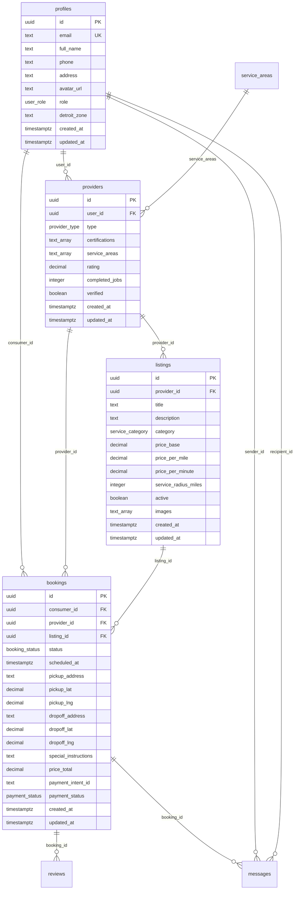
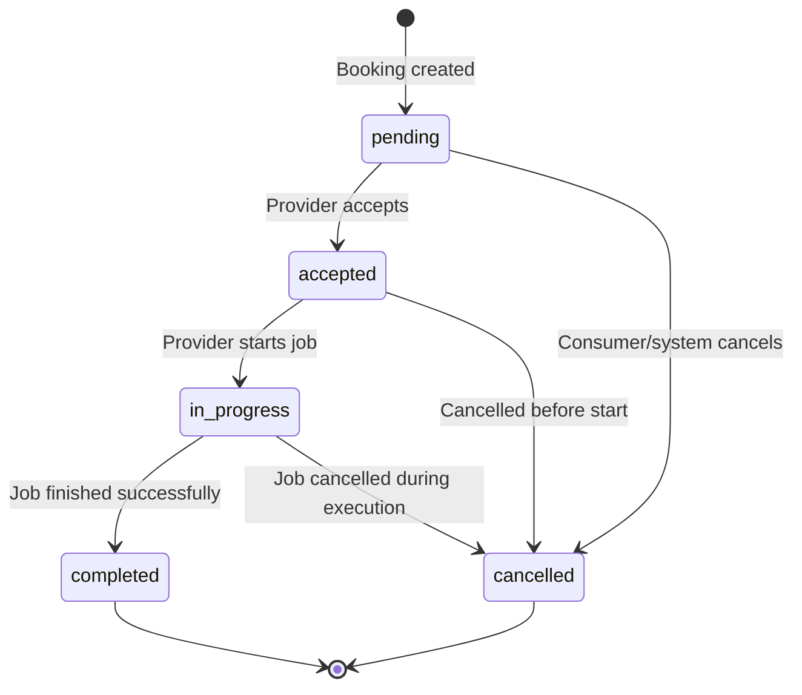

# SkyMarket Database Schema Documentation

This document provides comprehensive documentation of the SkyMarket database schema, relationships, and data patterns.

## Database Overview

**Database Engine**: PostgreSQL 15+  
**ORM/Client**: Supabase Client with TypeScript  
**Security**: Row Level Security (RLS) policies  
**Hosting**: Supabase Cloud Platform  

### Design Principles

1. **Normalization**: Minimize data redundancy while maintaining performance
2. **Security-First**: Row Level Security on all user data tables
3. **Performance**: Strategic indexing for common query patterns
4. **Scalability**: Partitioning strategy for high-volume tables
5. **Audit Trail**: Created/updated timestamps on all entities
6. **Type Safety**: Strong typing with TypeScript integration

## Schema Overview



## Core Tables

### profiles

Extends Supabase `auth.users` with application-specific user data.

```sql
CREATE TABLE profiles (
  id UUID PRIMARY KEY REFERENCES auth.users(id) ON DELETE CASCADE,
  created_at TIMESTAMPTZ DEFAULT NOW(),
  updated_at TIMESTAMPTZ DEFAULT NOW(),
  email TEXT UNIQUE NOT NULL,
  full_name TEXT,
  phone TEXT,
  address TEXT,
  avatar_url TEXT,
  role user_role DEFAULT 'consumer',
  detroit_zone TEXT
);
```

#### Fields

| Field | Type | Required | Description |
|-------|------|----------|-------------|
| `id` | UUID | Yes | Primary key, references auth.users |
| `email` | TEXT | Yes | User email address (unique) |
| `full_name` | TEXT | No | User's full name |
| `phone` | TEXT | No | Phone number for notifications |
| `address` | TEXT | No | Primary address |
| `avatar_url` | TEXT | No | Profile image URL |
| `role` | user_role | Yes | User role: consumer, provider, admin |
| `detroit_zone` | TEXT | No | Detroit area zone for location-based features |

#### Indexes
```sql
CREATE INDEX idx_profiles_email ON profiles(email);
CREATE INDEX idx_profiles_role ON profiles(role);
CREATE INDEX idx_profiles_detroit_zone ON profiles(detroit_zone);
```

#### RLS Policies
```sql
-- Users can view public profile information
CREATE POLICY "Public profiles are viewable by everyone" ON profiles
  FOR SELECT USING (true);

-- Users can update their own profile
CREATE POLICY "Users can update own profile" ON profiles
  FOR UPDATE USING (auth.uid() = id);
```

### providers

Service provider information and certifications.

```sql
CREATE TABLE providers (
  id UUID PRIMARY KEY DEFAULT gen_random_uuid(),
  user_id UUID UNIQUE NOT NULL REFERENCES profiles(id) ON DELETE CASCADE,
  created_at TIMESTAMPTZ DEFAULT NOW(),
  updated_at TIMESTAMPTZ DEFAULT NOW(),
  type provider_type NOT NULL,
  certifications TEXT[] DEFAULT '{}',
  service_areas TEXT[] DEFAULT '{}',
  rating DECIMAL(3,2) DEFAULT 0.00,
  completed_jobs INTEGER DEFAULT 0,
  verified BOOLEAN DEFAULT FALSE
);
```

#### Fields

| Field | Type | Required | Description |
|-------|------|----------|-------------|
| `id` | UUID | Yes | Primary key |
| `user_id` | UUID | Yes | References profiles.id |
| `type` | provider_type | Yes | 'courier' or 'drone' |
| `certifications` | TEXT[] | No | Array of certification IDs/names |
| `service_areas` | TEXT[] | No | Detroit zones they serve |
| `rating` | DECIMAL(3,2) | No | Average rating (0.00-5.00) |
| `completed_jobs` | INTEGER | No | Total completed bookings |
| `verified` | BOOLEAN | No | Platform verification status |

#### Business Logic
- `rating` is calculated from reviews and updated via triggers
- `completed_jobs` incremented when bookings reach 'completed' status
- `verified` requires manual admin approval after document review

#### Indexes
```sql
CREATE INDEX idx_providers_user_id ON providers(user_id);
CREATE INDEX idx_providers_type ON providers(type);
CREATE INDEX idx_providers_verified ON providers(verified);
CREATE INDEX idx_providers_rating ON providers(rating DESC);
```

### listings

Service offerings from providers.

```sql
CREATE TABLE listings (
  id UUID PRIMARY KEY DEFAULT gen_random_uuid(),
  created_at TIMESTAMPTZ DEFAULT NOW(),
  updated_at TIMESTAMPTZ DEFAULT NOW(),
  provider_id UUID NOT NULL REFERENCES providers(id) ON DELETE CASCADE,
  title TEXT NOT NULL,
  description TEXT,
  category service_category NOT NULL,
  price_base DECIMAL(10,2) NOT NULL,
  price_per_mile DECIMAL(10,2),
  price_per_minute DECIMAL(10,2),
  service_radius_miles INTEGER DEFAULT 10,
  active BOOLEAN DEFAULT TRUE,
  images TEXT[] DEFAULT '{}'
);
```

#### Fields

| Field | Type | Required | Description |
|-------|------|----------|-------------|
| `provider_id` | UUID | Yes | Owner of the listing |
| `title` | TEXT | Yes | Service title |
| `description` | TEXT | No | Detailed description |
| `category` | service_category | Yes | food_delivery, courier, aerial_imaging, site_mapping |
| `price_base` | DECIMAL(10,2) | Yes | Base service price |
| `price_per_mile` | DECIMAL(10,2) | No | Distance-based pricing |
| `price_per_minute` | DECIMAL(10,2) | No | Time-based pricing |
| `service_radius_miles` | INTEGER | No | Service area radius (default: 10) |
| `active` | BOOLEAN | No | Whether listing is accepting bookings |
| `images` | TEXT[] | No | Array of image URLs |

#### Pricing Logic
```sql
-- Total price calculation
total_price = price_base + (distance_miles * price_per_mile) + (estimated_minutes * price_per_minute)
```

#### Indexes
```sql
CREATE INDEX idx_listings_provider_id ON listings(provider_id);
CREATE INDEX idx_listings_category ON listings(category);
CREATE INDEX idx_listings_active ON listings(active);
CREATE INDEX idx_listings_category_active ON listings(category, active);

-- Full-text search
CREATE INDEX idx_listings_search ON listings 
  USING GIN (to_tsvector('english', title || ' ' || COALESCE(description, '')));
```

### bookings

Order management and lifecycle tracking.

```sql
CREATE TABLE bookings (
  id UUID PRIMARY KEY DEFAULT gen_random_uuid(),
  created_at TIMESTAMPTZ DEFAULT NOW(),
  updated_at TIMESTAMPTZ DEFAULT NOW(),
  consumer_id UUID NOT NULL REFERENCES profiles(id),
  provider_id UUID NOT NULL REFERENCES providers(id),
  listing_id UUID NOT NULL REFERENCES listings(id),
  status booking_status DEFAULT 'pending',
  scheduled_at TIMESTAMPTZ NOT NULL,
  pickup_address TEXT,
  pickup_lat DECIMAL(10,8),
  pickup_lng DECIMAL(11,8),
  dropoff_address TEXT NOT NULL,
  dropoff_lat DECIMAL(10,8) NOT NULL,
  dropoff_lng DECIMAL(11,8) NOT NULL,
  special_instructions TEXT,
  price_total DECIMAL(10,2) NOT NULL,
  payment_intent_id TEXT,
  payment_status payment_status DEFAULT 'pending'
);
```

#### Status Flow



#### Fields

| Field | Type | Required | Description |
|-------|------|----------|-------------|
| `consumer_id` | UUID | Yes | Who booked the service |
| `provider_id` | UUID | Yes | Who will provide the service |
| `listing_id` | UUID | Yes | What service was booked |
| `status` | booking_status | Yes | Current booking state |
| `scheduled_at` | TIMESTAMPTZ | Yes | When service should start |
| `pickup_address` | TEXT | No | Pickup location (if applicable) |
| `pickup_lat/lng` | DECIMAL | No | Pickup coordinates |
| `dropoff_address` | TEXT | Yes | Delivery/service location |
| `dropoff_lat/lng` | DECIMAL | Yes | Service coordinates |
| `special_instructions` | TEXT | No | Customer instructions |
| `price_total` | DECIMAL(10,2) | Yes | Final agreed price |
| `payment_intent_id` | TEXT | No | Stripe payment intent ID |
| `payment_status` | payment_status | Yes | Payment state |

#### Constraints
```sql
-- Ensure booking is in future
ALTER TABLE bookings ADD CONSTRAINT booking_future_date 
  CHECK (scheduled_at > NOW());

-- Ensure dropoff coordinates are provided
ALTER TABLE bookings ADD CONSTRAINT booking_dropoff_coords
  CHECK (dropoff_lat IS NOT NULL AND dropoff_lng IS NOT NULL);
```

#### Indexes
```sql
CREATE INDEX idx_bookings_consumer_id ON bookings(consumer_id);
CREATE INDEX idx_bookings_provider_id ON bookings(provider_id);
CREATE INDEX idx_bookings_listing_id ON bookings(listing_id);
CREATE INDEX idx_bookings_status ON bookings(status);
CREATE INDEX idx_bookings_scheduled_at ON bookings(scheduled_at);
CREATE INDEX idx_bookings_provider_status ON bookings(provider_id, status);
```

### reviews

Two-sided rating and review system.

```sql
CREATE TABLE reviews (
  id UUID PRIMARY KEY DEFAULT gen_random_uuid(),
  created_at TIMESTAMPTZ DEFAULT NOW(),
  booking_id UUID UNIQUE NOT NULL REFERENCES bookings(id) ON DELETE CASCADE,
  reviewer_id UUID NOT NULL REFERENCES profiles(id),
  reviewed_id UUID NOT NULL REFERENCES profiles(id),
  rating INTEGER NOT NULL CHECK (rating >= 1 AND rating <= 5),
  comment TEXT,
  CHECK (reviewer_id != reviewed_id)
);
```

#### Fields

| Field | Type | Required | Description |
|-------|------|----------|-------------|
| `booking_id` | UUID | Yes | Which booking is being reviewed |
| `reviewer_id` | UUID | Yes | Who is leaving the review |
| `reviewed_id` | UUID | Yes | Who is being reviewed |
| `rating` | INTEGER | Yes | 1-5 star rating |
| `comment` | TEXT | No | Optional text review |

#### Business Rules
- Only one review per booking
- Reviews can only be left after booking completion
- Both consumer and provider can review each other
- Rating must be 1-5 stars

#### Indexes
```sql
CREATE INDEX idx_reviews_booking_id ON reviews(booking_id);
CREATE INDEX idx_reviews_reviewer_id ON reviews(reviewer_id);
CREATE INDEX idx_reviews_reviewed_id ON reviews(reviewed_id);
```

### messages

In-app messaging system for bookings.

```sql
CREATE TABLE messages (
  id UUID PRIMARY KEY DEFAULT gen_random_uuid(),
  created_at TIMESTAMPTZ DEFAULT NOW(),
  booking_id UUID NOT NULL REFERENCES bookings(id) ON DELETE CASCADE,
  sender_id UUID NOT NULL REFERENCES profiles(id),
  recipient_id UUID NOT NULL REFERENCES profiles(id),
  content TEXT NOT NULL,
  read BOOLEAN DEFAULT FALSE
);
```

#### Fields

| Field | Type | Required | Description |
|-------|------|----------|-------------|
| `booking_id` | UUID | Yes | Related booking |
| `sender_id` | UUID | Yes | Message sender |
| `recipient_id` | UUID | Yes | Message recipient |
| `content` | TEXT | Yes | Message text |
| `read` | BOOLEAN | No | Read status |

#### Indexes
```sql
CREATE INDEX idx_messages_booking_id ON messages(booking_id);
CREATE INDEX idx_messages_sender_id ON messages(sender_id);
CREATE INDEX idx_messages_recipient_id ON messages(recipient_id);
CREATE INDEX idx_messages_read ON messages(read);
```

## Supporting Tables

### service_areas

Predefined Detroit Metro service zones.

```sql
CREATE TABLE service_areas (
  id UUID PRIMARY KEY DEFAULT gen_random_uuid(),
  name TEXT NOT NULL,
  center_lat DECIMAL(10,8) NOT NULL,
  center_lng DECIMAL(11,8) NOT NULL,
  radius_miles INTEGER NOT NULL
);
```

#### Default Data
```sql
INSERT INTO service_areas (name, center_lat, center_lng, radius_miles) VALUES
  ('Downtown Detroit', 42.3314, -83.0458, 5),
  ('Midtown Detroit', 42.3564, -83.0666, 3),
  ('Corktown', 42.3316, -83.0625, 2),
  ('Royal Oak', 42.4895, -83.1446, 4),
  ('Birmingham', 42.5468, -83.2113, 3),
  ('Dearborn', 42.3223, -83.1763, 5),
  ('Grosse Pointe', 42.3861, -82.9116, 3),
  ('Ferndale', 42.4604, -83.1345, 2);
```

## Custom Types (Enums)

### user_role
```sql
CREATE TYPE user_role AS ENUM ('consumer', 'provider', 'admin');
```

### provider_type
```sql
CREATE TYPE provider_type AS ENUM ('courier', 'drone');
```

### service_category
```sql
CREATE TYPE service_category AS ENUM (
  'food_delivery', 
  'courier', 
  'aerial_imaging', 
  'site_mapping'
);
```

### booking_status
```sql
CREATE TYPE booking_status AS ENUM (
  'pending', 
  'accepted', 
  'in_progress', 
  'completed', 
  'cancelled'
);
```

### payment_status
```sql
CREATE TYPE payment_status AS ENUM (
  'pending', 
  'paid', 
  'failed', 
  'refunded'
);
```

## Database Functions & Triggers

### Auto-update timestamps

```sql
CREATE OR REPLACE FUNCTION update_updated_at_column()
RETURNS TRIGGER AS $$
BEGIN
  NEW.updated_at = NOW();
  RETURN NEW;
END;
$$ language 'plpgsql';

-- Apply to all tables with updated_at
CREATE TRIGGER update_profiles_updated_at BEFORE UPDATE ON profiles
  FOR EACH ROW EXECUTE FUNCTION update_updated_at_column();

CREATE TRIGGER update_providers_updated_at BEFORE UPDATE ON providers
  FOR EACH ROW EXECUTE FUNCTION update_updated_at_column();

CREATE TRIGGER update_listings_updated_at BEFORE UPDATE ON listings
  FOR EACH ROW EXECUTE FUNCTION update_updated_at_column();

CREATE TRIGGER update_bookings_updated_at BEFORE UPDATE ON bookings
  FOR EACH ROW EXECUTE FUNCTION update_updated_at_column();
```

### Automatic profile creation

```sql
CREATE OR REPLACE FUNCTION public.handle_new_user()
RETURNS trigger AS $$
BEGIN
  INSERT INTO public.profiles (id, email)
  VALUES (new.id, new.email);
  RETURN new;
END;
$$ LANGUAGE plpgsql SECURITY DEFINER;

CREATE TRIGGER on_auth_user_created
  AFTER INSERT ON auth.users
  FOR EACH ROW EXECUTE FUNCTION public.handle_new_user();
```

### Update provider ratings

```sql
CREATE OR REPLACE FUNCTION update_provider_rating()
RETURNS TRIGGER AS $$
DECLARE
  provider_uuid UUID;
  avg_rating DECIMAL(3,2);
BEGIN
  -- Get the provider being reviewed
  SELECT p.id INTO provider_uuid
  FROM providers p
  JOIN profiles pr ON p.user_id = pr.id
  WHERE pr.id = NEW.reviewed_id AND p.user_id IS NOT NULL;

  IF provider_uuid IS NOT NULL THEN
    -- Calculate new average rating
    SELECT AVG(rating) INTO avg_rating
    FROM reviews r
    JOIN profiles pr ON r.reviewed_id = pr.id
    JOIN providers p ON p.user_id = pr.id
    WHERE p.id = provider_uuid;

    -- Update provider rating
    UPDATE providers 
    SET rating = COALESCE(avg_rating, 0.00)
    WHERE id = provider_uuid;
  END IF;

  RETURN NEW;
END;
$$ LANGUAGE plpgsql;

CREATE TRIGGER update_provider_rating_trigger
  AFTER INSERT OR UPDATE ON reviews
  FOR EACH ROW EXECUTE FUNCTION update_provider_rating();
```

## Row Level Security (RLS) Policies

### profiles
```sql
-- Public profile viewing
CREATE POLICY "Public profiles are viewable by everyone" ON profiles
  FOR SELECT USING (true);

-- Users can update their own profile
CREATE POLICY "Users can update own profile" ON profiles
  FOR UPDATE USING (auth.uid() = id);
```

### providers
```sql
-- Providers are viewable by everyone
CREATE POLICY "Providers are viewable by everyone" ON providers
  FOR SELECT USING (true);

-- Users can create their own provider profile
CREATE POLICY "Users can create own provider profile" ON providers
  FOR INSERT WITH CHECK (auth.uid() = user_id);

-- Users can update their own provider profile
CREATE POLICY "Users can update own provider profile" ON providers
  FOR UPDATE USING (auth.uid() = user_id);
```

### listings
```sql
-- Active listings are viewable by everyone
CREATE POLICY "Active listings are viewable by everyone" ON listings
  FOR SELECT USING (active = true OR provider_id IN (
    SELECT id FROM providers WHERE user_id = auth.uid()
  ));

-- Providers can manage their own listings
CREATE POLICY "Providers can create own listings" ON listings
  FOR INSERT WITH CHECK (provider_id IN (
    SELECT id FROM providers WHERE user_id = auth.uid()
  ));

CREATE POLICY "Providers can update own listings" ON listings
  FOR UPDATE USING (provider_id IN (
    SELECT id FROM providers WHERE user_id = auth.uid()
  ));

CREATE POLICY "Providers can delete own listings" ON listings
  FOR DELETE USING (provider_id IN (
    SELECT id FROM providers WHERE user_id = auth.uid()
  ));
```

### bookings
```sql
-- Users can view bookings they're involved in
CREATE POLICY "Users can view own bookings" ON bookings
  FOR SELECT USING (
    consumer_id = auth.uid() OR 
    provider_id IN (SELECT id FROM providers WHERE user_id = auth.uid())
  );

-- Consumers can create bookings
CREATE POLICY "Consumers can create bookings" ON bookings
  FOR INSERT WITH CHECK (consumer_id = auth.uid());

-- Both parties can update booking status
CREATE POLICY "Users can update own bookings" ON bookings
  FOR UPDATE USING (
    consumer_id = auth.uid() OR 
    provider_id IN (SELECT id FROM providers WHERE user_id = auth.uid())
  );
```

### reviews
```sql
-- Reviews are viewable by everyone
CREATE POLICY "Reviews are viewable by everyone" ON reviews
  FOR SELECT USING (true);

-- Users can create reviews for completed bookings
CREATE POLICY "Users can create reviews for completed bookings" ON reviews
  FOR INSERT WITH CHECK (
    reviewer_id = auth.uid() AND
    booking_id IN (
      SELECT id FROM bookings 
      WHERE status = 'completed' 
      AND (consumer_id = auth.uid() OR provider_id IN (
        SELECT id FROM providers WHERE user_id = auth.uid()
      ))
    )
  );
```

### messages
```sql
-- Users can view messages they sent or received
CREATE POLICY "Users can view own messages" ON messages
  FOR SELECT USING (
    sender_id = auth.uid() OR recipient_id = auth.uid()
  );

-- Users can send messages for their bookings
CREATE POLICY "Users can send messages" ON messages
  FOR INSERT WITH CHECK (
    sender_id = auth.uid() AND
    booking_id IN (
      SELECT id FROM bookings
      WHERE consumer_id = auth.uid() OR provider_id IN (
        SELECT id FROM providers WHERE user_id = auth.uid()
      )
    )
  );

-- Recipients can mark messages as read
CREATE POLICY "Recipients can mark messages as read" ON messages
  FOR UPDATE USING (recipient_id = auth.uid());
```

## Query Patterns & Performance

### Common Queries

#### Find nearby providers
```sql
-- Get providers within radius of a point
SELECT 
  p.*,
  pr.full_name,
  pr.avatar_url,
  COUNT(l.id) as listing_count,
  AVG(l.price_base) as avg_price
FROM providers p
JOIN profiles pr ON p.user_id = pr.id
LEFT JOIN listings l ON p.id = l.provider_id AND l.active = true
WHERE p.verified = true
  AND p.service_areas && ARRAY['Downtown Detroit', 'Midtown Detroit']
GROUP BY p.id, pr.full_name, pr.avatar_url
ORDER BY p.rating DESC, p.completed_jobs DESC
LIMIT 20;
```

#### Get booking history with details
```sql
-- Consumer booking history
SELECT 
  b.*,
  l.title as service_title,
  l.category,
  pr.full_name as provider_name,
  pr.avatar_url as provider_avatar
FROM bookings b
JOIN listings l ON b.listing_id = l.id
JOIN providers p ON b.provider_id = p.id
JOIN profiles pr ON p.user_id = pr.id
WHERE b.consumer_id = $1
ORDER BY b.created_at DESC
LIMIT 50;
```

#### Search listings with filters
```sql
-- Search with full-text search and filters
SELECT 
  l.*,
  p.rating as provider_rating,
  p.verified as provider_verified,
  pr.full_name as provider_name,
  ts_rank(to_tsvector('english', l.title || ' ' || COALESCE(l.description, '')), 
           plainto_tsquery('english', $1)) as search_rank
FROM listings l
JOIN providers p ON l.provider_id = p.id
JOIN profiles pr ON p.user_id = pr.id
WHERE l.active = true
  AND l.category = $2
  AND p.rating >= $3
  AND to_tsvector('english', l.title || ' ' || COALESCE(l.description, '')) @@ plainto_tsquery('english', $1)
ORDER BY search_rank DESC, p.rating DESC
LIMIT 20;
```

### Performance Optimization

#### Composite Indexes
```sql
-- Optimized for common filter combinations
CREATE INDEX idx_listings_category_active_rating ON listings(category, active) 
  INCLUDE (price_base) WHERE active = true;

CREATE INDEX idx_bookings_provider_status_scheduled ON bookings(provider_id, status, scheduled_at) 
  WHERE status IN ('pending', 'accepted');

CREATE INDEX idx_providers_verified_rating ON providers(verified, rating DESC) 
  WHERE verified = true;
```

#### Materialized Views for Analytics
```sql
-- Provider performance summary
CREATE MATERIALIZED VIEW provider_stats AS
SELECT 
  p.id,
  p.user_id,
  p.rating,
  p.completed_jobs,
  COUNT(DISTINCT l.id) as active_listings,
  COUNT(DISTINCT CASE WHEN b.status = 'completed' AND b.created_at > NOW() - INTERVAL '30 days' THEN b.id END) as jobs_last_30_days,
  AVG(CASE WHEN b.status = 'completed' AND b.created_at > NOW() - INTERVAL '30 days' THEN b.price_total END) as avg_order_value_30_days
FROM providers p
LEFT JOIN listings l ON p.id = l.provider_id AND l.active = true
LEFT JOIN bookings b ON p.id = b.provider_id
GROUP BY p.id, p.user_id, p.rating, p.completed_jobs;

-- Refresh materialized view hourly
CREATE INDEX ON provider_stats(id);
```

## Data Migration Strategy

### Version Control
```sql
-- Migration tracking table
CREATE TABLE schema_migrations (
  version TEXT PRIMARY KEY,
  applied_at TIMESTAMPTZ DEFAULT NOW(),
  description TEXT
);
```

### Migration Scripts
```bash
# Migration file naming: YYYYMMDD_HHmmss_description.sql
20241201_120000_initial_schema.sql
20241205_150000_add_provider_verification.sql
20241210_100000_add_message_attachments.sql
```

### Rollback Strategy
Each migration includes rollback instructions:
```sql
-- Migration: 20241205_150000_add_provider_verification.sql
-- Up
ALTER TABLE providers ADD COLUMN verification_document_url TEXT;
CREATE INDEX idx_providers_verification ON providers(verification_document_url);

-- Down (for rollback)
-- DROP INDEX idx_providers_verification;
-- ALTER TABLE providers DROP COLUMN verification_document_url;
```

## Backup & Recovery

### Automated Backups
- **Full backups**: Daily at 2 AM EST
- **Incremental backups**: Every 4 hours
- **Point-in-time recovery**: 7 days retention
- **Cross-region replication**: Enabled for disaster recovery

### Data Retention Policies
```sql
-- Clean up old data periodically
DELETE FROM messages WHERE created_at < NOW() - INTERVAL '1 year';
DELETE FROM bookings WHERE status IN ('cancelled', 'completed') AND created_at < NOW() - INTERVAL '2 years';

-- Archive completed bookings older than 1 year
CREATE TABLE bookings_archive (LIKE bookings INCLUDING ALL);
```

---

This database schema provides a robust foundation for SkyMarket's marketplace operations with strong security, performance optimization, and scalability considerations.