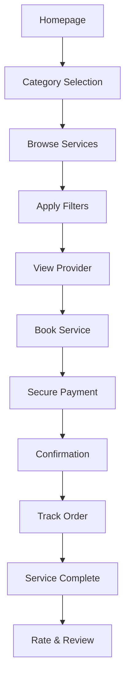

---
MOC:
  - "[[ID Ventures MOC]]"
  - "[[WNCP AI MOC]]"
tags:
  - "#Client/ID_Ventures/MMAIH"
  - "#MMAIH2025"
  - "#Type/Documentation"
  - "#Product_Management"
  - "#UI_UX"
created: 2025-08-15
Description: Comprehensive UI design document with screen flows, wireframes, and component system for SkyMarket multi-modal marketplace platform
client:
  - ID Ventures
---

# 🎨 SkyMarket UI Design & Screen Flow

> A comprehensive web-first design document defining the user interface architecture, screen flows, wireframes, and reusable component system for the SkyMarket drone service marketplace, inspired by modern category-based marketplaces like Airtasker and TaskRabbit.

---

## 1. Screen Architecture Overview

### 1.1 Web-First Architecture



### 1.2 Primary User Journeys

#### Consumer Journey
- **Discovery**: Land on homepage → Browse categories → Search/filter providers
- **Selection**: Compare providers → View profiles → Check availability
- **Booking**: Configure service → Add details → Complete payment
- **Fulfillment**: Track progress → Communicate → Confirm completion → Leave review

#### Provider Journey  
- **Onboarding**: Create profile → Add services → Set availability → Verify credentials
- **Management**: Dashboard overview → Manage bookings → Update availability
- **Execution**: Accept jobs → Navigate to location → Complete service → Get paid

### 1.3 Information Architecture

```
SkyMarket Web Structure
│
├── Public Pages
│   ├── Homepage (category grid, search, how it works)
│   ├── Category Pages (Food, Courier, Aerial)
│   ├── Provider Profiles
│   ├── About Us
│   └── Help Center
│
├── Consumer Portal
│   ├── Browse & Search
│   ├── Booking Flow
│   ├── Order History
│   ├── Active Orders
│   └── Account Settings
│
└── Provider Portal
    ├── Dashboard (stats, earnings, calendar)
    ├── Job Management
    ├── Service Listings
    ├── Availability Calendar
    └── Earnings & Payouts
```

---

## 2. Web Interface Designs

### 2.1 Homepage (1440px Desktop)

```
┌──────────────────────────────────────────────────────────────────────────────────────────────┐
│  🚁 SkyMarket          [Browse Services] [How It Works] [Become a Provider]   [Sign In] [→]  │
├──────────────────────────────────────────────────────────────────────────────────────────────┤
│                                                                                              │
│  ╔══════════════════════════════════════════════════════════════════════════════════════╗  │
│  ║                                                                                        ║  │
│  ║                    Find trusted drone operators for any service                       ║  │
│  ║                                                                                        ║  │
│  ║   ┌──────────────────────────────────────────────────────────────────────────┐      ║  │
│  ║   │ 🔍 What service do you need?                        📍 Castle Hill NSW  ▼│      ║  │
│  ║   └──────────────────────────────────────────────────────────────────────────┘      ║  │
│  ║                                                                                        ║  │
│  ║                              [ Search Services ]                                       ║  │
│  ║                                                                                        ║  │
│  ╚══════════════════════════════════════════════════════════════════════════════════════╝  │
│                                                                                              │
│  Popular Categories                                                              [View All] │
│  ┌─────────────────────┐  ┌─────────────────────┐  ┌─────────────────────┐               │
│  │ ┌─────────────────┐ │  │ ┌─────────────────┐ │  │ ┌─────────────────┐ │               │
│  │ │                 │ │  │ │                 │ │  │ │                 │ │               │
│  │ │  [Food Image]   │ │  │ │ [Package Image] │ │  │ │ [Drone Image]   │ │               │
│  │ │                 │ │  │ │                 │ │  │ │                 │ │               │
│  │ └─────────────────┘ │  │ └─────────────────┘ │  │ └─────────────────┘ │               │
│  │                     │  │                     │  │                     │               │
│  │  🍔 Food Delivery   │  │  📦 Courier Service │  │  📸 Aerial Imaging  │               │
│  │  Fast & reliable    │  │  Same-day delivery │  │  Professional shots │               │
│  │  From $4.99         │  │  From $7.99        │  │  From $149/hr      │               │
│  │                     │  │                     │  │                     │               │
│  │  [Browse →]         │  │  [Browse →]        │  │  [Browse →]        │               │
│  └─────────────────────┘  └─────────────────────┘  └─────────────────────┘               │
│                                                                                              │
│  How It Works                                                                               │
│  ┌──────────────────┐  ┌──────────────────┐  ┌──────────────────┐  ┌──────────────────┐  │
│  │  1. Search       │→ │  2. Compare      │→ │  3. Book         │→ │  4. Track        │  │
│  │  Find services  │  │  View providers  │  │  Secure payment │  │  Real-time       │  │
│  │  in your area   │  │  and prices      │  │  and scheduling │  │  updates         │  │
│  └──────────────────┘  └──────────────────┘  └──────────────────┘  └──────────────────┘  │
│                                                                                              │
│  Featured Drone Operators                                                      [View All]   │
│  ┌────────────────────┐ ┌────────────────────┐ ┌────────────────────┐ ┌────────────────┐ │
│  │ [Operator Image]   │ │ [Operator Image]   │ │ [Operator Image]   │ │ [Operator Image]│ │
│  │ Mike R. ⭐ 4.9     │ │ Sarah K. ⭐ 5.0    │ │ Tom L. ⭐ 4.8      │ │ Amy C. ⭐ 4.9   │ │
│  │ Food & Courier     │ │ Aerial Specialist  │ │ All Services       │ │ Express Courier │ │
│  │ 500+ deliveries    │ │ FAA Certified      │ │ Available 24/7     │ │ Same-day ready  │ │
│  └────────────────────┘ └────────────────────┘ └────────────────────┘ └────────────────┘ │
│                                                                                              │
└──────────────────────────────────────────────────────────────────────────────────────────────┘
```

### 2.2 Category Browse Page (Food Delivery)

```
┌──────────────────────────────────────────────────────────────────────────────────────────────┐
│  🚁 SkyMarket  >  Food Delivery                                               [Sign In] [→]  │
├──────────────────────────────────────────────────────────────────────────────────────────────┤
│                                                                                              │
│  ┌────────────────────┐  ┌─────────────────────────────────────────────────────────────────┐│
│  │ FILTERS            │  │  Showing 24 drone operators in Castle Hill NSW    Sort: Rating ▼││
│  │                    │  │                                                                 ││
│  │ Price Range        │  │  ┌──────────────┐ ┌──────────────┐ ┌──────────────┐            ││
│  │ ○ $0-10            │  │  │ [Food Image] │ │ [Food Image] │ │ [Food Image] │            ││
│  │ ● $10-20           │  │  │              │ │              │ │              │            ││
│  │ ○ $20-30           │  │  │  Mike's      │ │  Express     │ │  Sky Eats    │            ││
│  │ ○ $30+             │  │  │  Delivery    │ │  Drones      │ │  Service     │            ││
│  │                    │  │  │              │ │              │ │              │            ││
│  │ Rating             │  │  │ ⭐ 4.9 (320) │ │ ⭐ 4.8 (245) │ │ ⭐ 5.0 (189) │            ││
│  │ ☑ 5 stars         │  │  │              │ │              │ │              │            ││
│  │ ☑ 4+ stars        │  │  │ 15-20 min    │ │ 10-15 min    │ │ 20-25 min    │            ││
│  │ ☐ 3+ stars        │  │  │ $2.99 fee    │ │ $4.99 fee    │ │ $3.99 fee    │            ││
│  │                    │  │  │              │ │              │ │              │            ││
│  │ Delivery Time      │  │  │ [View →]     │ │ [View →]     │ │ [View →]     │            ││
│  │ ☑ Under 30 min    │  │  └──────────────┘ └──────────────┘ └──────────────┘            ││
│  │ ☐ 30-60 min       │  │                                                                 ││
│  │ ☐ 1-2 hours       │  │  ┌──────────────┐ ┌──────────────┐ ┌──────────────┐            ││
│  │                    │  │  │ [Food Image] │ │ [Food Image] │ │ [Food Image] │            ││
│  │ Distance           │  │  │              │ │              │ │              │            ││
│  │ ● Within 5km       │  │  │  QuickBite   │ │  AeroMeals   │ │  FlyFood     │            ││
│  │ ○ 5-10km          │  │  │  Drone       │ │  Express     │ │  Delivery    │            ││
│  │ ○ 10-20km         │  │  │              │ │              │ │              │            ││
│  │                    │  │  │ ⭐ 4.7 (412) │ │ ⭐ 4.6 (523) │ │ ⭐ 4.9 (267) │            ││
│  │ Features           │  │  │              │ │              │ │              │            ││
│  │ ☐ Contactless     │  │  │ 25-30 min    │ │ 15-20 min    │ │ 20-25 min    │            ││
│  │ ☐ Insulated       │  │  │ $1.99 fee    │ │ $3.49 fee    │ │ $2.49 fee    │            ││
│  │ ☐ Express         │  │  │              │ │              │ │              │            ││
│  │                    │  │  │ [View →]     │ │ [View →]     │ │ [View →]     │            ││
│  │ [Clear Filters]    │  │  └──────────────┘ └──────────────┘ └──────────────┘            ││
│  │                    │  │                                                                 ││
│  └────────────────────┘  │  [Load More Services]                                           ││
│                          └─────────────────────────────────────────────────────────────────┘│
└──────────────────────────────────────────────────────────────────────────────────────────────┘
```

### 2.3 Provider Detail Page (Two-Column Layout)

```
┌──────────────────────────────────────────────────────────────────────────────────────────────┐
│  🚁 SkyMarket  >  Food Delivery  >  Mike's Delivery Service                  [Sign In] [→]  │
├──────────────────────────────────────────────────────────────────────────────────────────────┤
│                                                                                              │
│  ┌───────────────────────────────────────────────────────┐ ┌───────────────────────────────┐ │
│  │  LEFT COLUMN (60%) - Service Details               │ │  RIGHT COLUMN (40%) - Booking  │ │
│  │                                                     │ │                                 │ │
│  │  ┌────────────────────────────────────────────────┐  │ │  ╔══════════════════════════╗  │ │
│  │  │                                              │  │ │  ║  BOOK THIS SERVICE    ║  │ │
│  │  │          [Main Service Image]               │  │ │  ║                        ║  │ │
│  │  │                                              │  │ │  ║  Price                 ║  │ │
│  │  └────────────────────────────────────────────────┘  │ │  ║  From $2.99            ║  │ │
│  │  [Thumb 1] [Thumb 2] [Thumb 3] [Thumb 4] [→]      │ │  ║                        ║  │ │
│  │                                                     │ │  ║  Delivery Time         ║  │ │
│  │  Mike's Delivery Service                           │ │  ║  ⛱ ASAP (15-20 min)    ║  │ │
│  │  ⭐ 4.9 (320 reviews) • 500+ deliveries            │ │  ║  ══════════════════════  ║  │ │
│  │  [✓] Verified • [✓] Background Check • [✓] Insured │ │  ║  Date & Time           ║  │ │
│  │                                                     │ │  ║  [Today ▼] [2:00 PM ▼] ║  │ │
│  │  ═════════════════════════════════════════════════  │ │  ║                        ║  │ │
│  │                                                     │ │  ║  Location              ║  │ │
│  │  [Overview] [Services] [Reviews] [Credentials]     │ │  ║  📍 Castle Hill NSW   ║  │ │
│  │                                                     │ │  ║  [Change]              ║  │ │
│  │  About This Operator                                │ │  ║                        ║  │ │
│  │  Professional drone operator specializing in food  │ │  ║  Special Instructions  ║  │ │
│  │  delivery with 2+ years experience. Fast, reliable │ │  ║  ┌──────────────────┐  ║  │ │
│  │  service with temperature-controlled compartments. │ │  ║  │ Add notes...   │  ║  │ │
│  │                                                     │ │  ║  └──────────────────┘  ║  │ │
│  │  Services Offered                                   │ │  ║                        ║  │ │
│  │  • Food Delivery (15-20 min average)               │ │  ║  Estimated Total       ║  │ │
│  │  • Grocery Delivery (same day)                     │ │  ║  Delivery Fee: $2.99   ║  │ │
│  │  • Package Courier (up to 5kg)                     │ │  ║  Service Fee:  $0.30   ║  │ │
│  │  • Express Service Available (+$2)                 │ │  ║  ────────────────────  ║  │ │
│  │                                                     │ │  ║  Total: $3.29          ║  │ │
│  │  Service Area                                       │ │  ║                        ║  │ │
│  │  ┌────────────────────────────────────────────────┐  │ │  ║  [ Book Now → ]       ║  │ │
│  │  │            [Map with service radius]         │  │ │  ║                        ║  │ │
│  │  │            5km radius from base             │  │ │  ║  ✓ Secure Payment      ║  │ │
│  │  └────────────────────────────────────────────────┘  │ │  ║  ✓ Money-back Guarantee║  │ │
│  │                                                     │ │  ╚══════════════════════════╝  │ │
│  │  Recent Reviews                                     │ │                                 │ │
│  │  ─────────────────────────────────────────────────  │ │  Need Help?                    │ │
│  │  Sarah M. ⭐⭐⭐⭐⭐  2 days ago                 │ │  💬 Chat with operator        │ │
│  │  "Super fast delivery! Food was still hot."        │ │  📞 Call support              │ │
│  │                                                     │ │  ❓ View FAQs                   │ │
│  │  John D. ⭐⭐⭐⭐☆  1 week ago                  │ │                                 │ │
│  │  "Good service, slightly delayed due to weather"   │ │                                 │ │
│  │                                                     │ │                                 │ │
│  │  [View All 320 Reviews]                             │ │                                 │ │
│  │                                                     │ │                                 │ │
│  └───────────────────────────────────────────────────────┘ └───────────────────────────────┘ │
│                                                                                              │
└──────────────────────────────────────────────────────────────────────────────────────────────┘
```

### 2.4 Booking Confirmation Modal

```
┌──────────────────────────────────────────────────────────────────────────────────────────────┐
│                                  Modal Overlay (Centered on Screen)                         │
│                                                                                              │
│        ╔══════════════════════════════════════════════════════════════╗                         │
│        ║  Confirm Your Booking                                    [×]║                         │
│        ║  ──────────────────────────────────────────────────────  ║                         │
│        ║                                                            ║                         │
│        ║  Service Details                                           ║                         │
│        ║  ┌──────────────────────────────────────────────────┐  ║                         │
│        ║  │  Mike's Delivery Service                        │  ║                         │
│        ║  │  Food Delivery • 15-20 minutes                  │  ║                         │
│        ║  │  Pickup: ASAP                                   │  ║                         │
│        ║  │  Location: Castle Hill NSW                      │  ║                         │
│        ║  └──────────────────────────────────────────────────┘  ║                         │
│        ║                                                            ║                         │
│        ║  Price Breakdown                                           ║                         │
│        ║  ┌──────────────────────────────────────────────────┐  ║                         │
│        ║  │  Delivery Fee                      $2.99      │  ║                         │
│        ║  │  Service Fee (10%)                 $0.30      │  ║                         │
│        ║  │  Tip (20%)                         $0.60      │  ║                         │
│        ║  │  ────────────────────────────────────────────  │  ║                         │
│        ║  │  Total                             $3.89      │  ║                         │
│        ║  └──────────────────────────────────────────────────┘  ║                         │
│        ║                                                            ║                         │
│        ║  Payment Method                                            ║                         │
│        ║  ┌──────────────────────────────────────────────────┐  ║                         │
│        ║  │  💳 Visa ending in 4242           [Change]  │  ║                         │
│        ║  └──────────────────────────────────────────────────┘  ║                         │
│        ║                                                            ║                         │
│        ║  ℹ Your payment will be held securely until service        ║                         │
│        ║    is complete. You can cancel anytime before pickup.     ║                         │
│        ║                                                            ║                         │
│        ║  [Cancel]                    [ 🔒 Confirm Booking ]    ║                         │
│        ║                                                            ║                         │
│        ╚══════════════════════════════════════════════════════════════╝                         │
│                                                                                              │
└──────────────────────────────────────────────────────────────────────────────────────────────┘
```

### 2.5 Order Tracking Page

```
┌────────────────────────────────────────────────────────────┐
│  [×] Order #SK-2024-0815                                  │
├────────────────────────────────────────────────────────────┤
│                                                            │
│  ┌──────────────────────────────────────────────────┐    │
│  │                                                    │    │
│  │                    [MAP VIEW]                      │    │
│  │                                                    │    │
│  │         📍───────🚴───────📍                      │    │
│  │       Pickup            Delivery                   │    │
│  │                                                    │    │
│  │                                                    │    │
│  └──────────────────────────────────────────────────┘    │
│                                                            │
├────────────────────────────────────────────────────────────┤
│  Mike R. is on the way!                   ETA: 2:15 PM   │
│  🚴 Bike Courier • ⭐ 4.9                                │
│                                                            │
│  Status Timeline                                          │
│                                                            │
│  ✅ Order Placed                              2:00 PM    │
│  ✅ Accepted by Courier                       2:02 PM    │
│  ✅ Picked Up                                 2:08 PM    │
│  ⏳ En Route to You                          Now        │
│  ○  Delivered                                 2:15 PM    │
│                                                            │
├────────────────────────────────────────────────────────────┤
│                                                            │
│        [ 💬 Message Courier ]  [ 📞 Call ]              │
│                                                            │
└────────────────────────────────────────────────────────────┘
```

---

## 3. Provider Portal

### 3.1 Provider Dashboard (With Sidebar)

```
┌──────────────────────────────────────────────────────────────────────────────────────────────┐
│  🚁 SkyMarket Provider Portal                                        Mike R. 🔔 (3) [👤] [→]  │
├──────────────────────────────────────────────────────────────────────────────────────────────┤
│                                                                                              │
│  ┌────────────────────┐  ┌─────────────────────────────────────────────────────────────────┐│
│  │ SIDEBAR            │  │ MAIN CONTENT AREA                                              ││
│  │                    │  │                                                                ││
│  │ [ ONLINE ✓ ]       │  │ Welcome back, Mike!                          Today: Aug 15    ││
│  │                    │  │                                                                ││
│  │ Dashboard          │  │ ┌────────────────┐ ┌────────────────┐ ┌────────────────┐ ┌────────────────┐ ││
│  │ • Overview        │  │ │ Today's Jobs  │ │ Total Earned   │ │ Avg Rating     │ │ On-Time Rate   │ ││
│  │ • Stats           │  │ │      12       │ │   $127.50      │ │   ⭐ 4.9       │ │     98%        │ ││
│  │                    │  │ │  +2 from yday │ │  +$23 today    │ │  320 reviews   │ │  500+ delivered│ ││
│  │ Job Management     │  │ └────────────────┘ └────────────────┘ └────────────────┘ └────────────────┘ ││
│  │ • Available Jobs  │  │                                                                ││
│  │ • Active Jobs (2) │  │ Available Jobs Near You                        [🔄 Refresh]  ││
│  │ • Job History     │  │                                                                ││
│  │                    │  │ ┌──────────────────────────────────────────────────────────┐ ││
│  │ My Services        │  │ │ 🍔 Food Delivery - Castle Hill Plaza                      │ ││
│  │ • Service List    │  │ │ $8.50 • 0.8 mi • Pickup in 5 min                          │ ││
│  │ • Availability    │  │ │ Customer: John D.                     ⏱ 2:45 remaining   │ ││
│  │ • Service Areas   │  │ │                                                          │ ││
│  │                    │  │ │           [Decline]              [Accept Job]            │ ││
│  │ Earnings           │  │ └──────────────────────────────────────────────────────────┘ ││
│  │ • Today           │  │                                                                ││
│  │ • This Week       │  │ ┌──────────────────────────────────────────────────────────┐ ││
│  │ • Payouts         │  │ │ 📦 Package Delivery - Urgent                             │ ││
│  │                    │  │ │ $12.00 • 2.1 mi total • Fragile                          │ ││
│  │ Settings           │  │ │ Customer: Sarah M.                    ⏱ 5:00 remaining   │ ││
│  │ • Profile         │  │ │                                                          │ ││
│  │ • Notifications   │  │ │           [Decline]              [Accept Job]            │ ││
│  │ • Payment Info    │  │ └──────────────────────────────────────────────────────────┘ ││
│  │                    │  │                                                                ││
│  │ Help & Support     │  │ Recent Activity                                               ││
│  │ • Help Center     │  │ ┌──────────────────────────────────────────────────────────┐ ││
│  │ • FAQs            │  │ │ Time     Status        Job                     Amount  │ ││
│  │ • Contact         │  │ │ 2:15 PM  Completed  ✓  Food - Thai Palace      $7.50   │ ││
│  │                    │  │ │ 1:45 PM  Completed  ✓  Package - Office        $9.00   │ ││
│  │ [Switch to         │  │ │ 12:30 PM Completed  ✓  Food - Pizza Express   $6.50   │ ││
│  │  Consumer Mode]    │  │ │ 11:00 AM Cancelled  ×  Aerial - Photography   $0.00   │ ││
│  │                    │  │ └──────────────────────────────────────────────────────────┘ ││
│  │                    │  │                                                                ││
│  └────────────────────┘  └─────────────────────────────────────────────────────────────────┘│
│                                                                                              │
└──────────────────────────────────────────────────────────────────────────────────────────────┘
```

### 3.2 Service Listing Management

```
┌────────────────────────────────────────────────────────────┐
│  [←] Active Job                          #SK-2024-0815    │
├────────────────────────────────────────────────────────────┤
│                                                            │
│  ┌──────────────────────────────────────────────────┐    │
│  │                                                    │    │
│  │              [NAVIGATION MAP]                      │    │
│  │                                                    │    │
│  │         📍 You're here                            │    │
│  │          ↓                                         │    │
│  │         📍 Joe's Deli (0.3 mi)                   │    │
│  │                                                    │    │
│  └──────────────────────────────────────────────────┘    │
│                                                            │
│  [ 🗺️ Open in Maps App ]                               │
│                                                            │
├────────────────────────────────────────────────────────────┤
│  Pickup Details                                           │
│                                                            │
│  📍 Joe's Deli                                           │
│  123 Main Street                                          │
│  Order: #JD-456                                          │
│  Contact: (555) 123-4567                                 │
│                                                            │
│  Special Instructions:                                    │
│  "Ask for Mike at counter"                               │
│                                                            │
│           [ ✅ Arrived at Pickup ]                       │
│                                                            │
├────────────────────────────────────────────────────────────┤
│  Delivery Details                                         │
│                                                            │
│  📍 456 Oak Street, Apt 3B                               │
│  Customer: Sarah M.                                       │
│  Notes: "Leave at door, text when delivered"             │
│                                                            │
│           [ 📸 Take Photo ]  [ ✅ Complete ]            │
│                                                            │
└────────────────────────────────────────────────────────────┘
```

---

## 4. Web Component System

### 4.1 Navigation Components

#### SkyHeader
```typescript
<SkyHeader>
  <Logo />
  <SearchBar placeholder="What service do you need?" />
  <LocationSelector value="Castle Hill NSW" />
  <NavLinks>
    <Link href="/browse">Browse Services</Link>
    <Link href="/how-it-works">How It Works</Link>
    <Link href="/become-provider">Become a Provider</Link>
  </NavLinks>
  <UserMenu notifications={3} />
</SkyHeader>

// Visual Specs:
// - Height: 72px
// - Background: #FFFFFF
// - Shadow: 0 2px 8px rgba(0,0,0,0.08)
// - Fixed position with z-index: 1000
// - Logo: 140px width
// - Search bar: 400px width, expandable
```

#### SkySidebar
```typescript
<SkySidebar mode="provider">
  <StatusToggle online={true} />
  <NavSection title="Dashboard">
    <NavItem icon="dashboard" active>Overview</NavItem>
    <NavItem icon="chart">Stats</NavItem>
  </NavSection>
  <NavSection title="Job Management">
    <NavItem icon="jobs" badge={5}>Available Jobs</NavItem>
    <NavItem icon="active" badge={2}>Active Jobs</NavItem>
  </NavSection>
</SkySidebar>

// Visual Specs:
// - Width: 260px
// - Height: calc(100vh - 72px)
// - Background: #FAFAFA
// - Border-right: 1px solid #E6E6E6
// - Sticky position
```

### 4.2 Category & Browse Components

#### SkyCategoryCard
```typescript
<SkyCategoryCard
  image="/images/food-delivery.jpg"
  title="Food Delivery"
  description="Fast & reliable"
  price="From $4.99"
  link="/browse/food-delivery"
  count={24}
/>

// Visual Specs:
// - Width: 100% (responsive grid)
// - Height: 280px
// - Image: 16:9 ratio, 180px height
// - Hover: transform: translateY(-4px)
// - Shadow on hover: 0 8px 16px rgba(0,0,0,0.12)
// - Border radius: 12px
// - Transition: all 0.3s ease
```

#### SkyProviderCard
```typescript
<SkyProviderCard
  image="/provider-photo.jpg"
  name="Mike's Delivery Service"
  rating={4.9}
  reviewCount={320}
  badges={['verified', 'top-rated', 'fast']}
  price="$2.99"
  deliveryTime="15-20 min"
  description="Professional drone operator specializing in food delivery"
  onView={handleView}
  featured={false}
/>

// Visual Specs:
// - Width: 100% (in 3-4 column grid)
// - Min-height: 320px
// - Image height: 160px
// - Padding: 16px
// - Hover state: box-shadow increase
// - CTA button appears on hover
```

#### SkyFilterPanel
```typescript
<SkyFilterPanel>
  <FilterSection title="Price Range">
    <RangeSlider min={0} max={50} value={[10, 30]} />
  </FilterSection>
  <FilterSection title="Rating">
    <Checkbox checked>5 stars</Checkbox>
    <Checkbox checked>4+ stars</Checkbox>
  </FilterSection>
  <FilterSection title="Delivery Time">
    <RadioGroup value="30min">
      <Radio value="30min">Under 30 min</Radio>
      <Radio value="60min">30-60 min</Radio>
    </RadioGroup>
  </FilterSection>
  <ClearFilters onClick={handleClear} />
</SkyFilterPanel>

// Visual Specs:
// - Width: 260px
// - Sticky top: 88px
// - Background: white
// - Sections: collapsible
// - Padding: 20px
```

### 4.3 Search & Input Components

#### SkySearchBar
```typescript
<SkySearchBar
  placeholder="Search for services, food, packages..."
  suggestions={[
    'Food delivery near me',
    'Express courier service',
    'Aerial photography'
  ]}
  onSearch={handleSearch}
  showCategories
/>

// Visual Specs:
// - Width: 400-600px (responsive)
// - Height: 48px
// - Icon: 20px search icon left
// - Dropdown: auto-complete results
// - Border: 1px solid #E6E6E6
// - Focus: 2px solid #BD1B04
```

#### SkyLocationSelector
```typescript
<SkyLocationSelector
  value="Castle Hill NSW"
  onChange={handleLocationChange}
  detectLocation
  showMap
/>

// Visual Specs:
// - Width: 200px
// - Dropdown with recent locations
// - Map preview on hover
// - Pin icon: 16px
```

#### SkyStepIndicator
```typescript
<SkyStepIndicator currentStep={2} totalSteps={4}>
  <Step label="Browse" completed />
  <Step label="Configure" active />
  <Step label="Payment" />
  <Step label="Track" />
</SkyStepIndicator>

// Visual Specs:
// - Dot Size: 8px (inactive), 12px (active)
// - Line Height: 2px
// - Completed: #1ABF8B
// - Active: #BD1B04
// - Inactive: #E6E6E6
```

### 4.3 Data Display Components

#### SkyProviderCard
```typescript
<SkyProviderCard
  image="/provider.jpg"
  name="Joe's Deli"
  rating={4.9}
  reviewCount={320}
  category="American"
  price="$$"
  distance="0.8 mi"
  deliveryOptions={[
    { type: 'bike', time: '15-20 min', price: '$2.99' },
    { type: 'car', time: '10-15 min', price: '$4.99' }
  ]}
  badges={['verified', 'top-rated']}
  onSelect={handleSelect}
/>

// Visual Specs:
// - Card Height: Variable (min 120px)
// - Image: 64x64px circle (left aligned)
// - Padding: 16px
// - Shadow: 0 2px 8px rgba(0,0,0,0.04)
```

#### SkyRatingStars
```typescript
<SkyRatingStars 
  value={4.5} 
  max={5} 
  size="md" // sm | md | lg
  interactive={false}
  onChange={handleRatingChange}
/>

// Visual Specs:
// - Star Sizes: sm(16px), md(20px), lg(24px)
// - Filled Color: #BD1B04
// - Empty Color: #E6E6E6
// - Half stars supported
```

### 4.4 Map Components

#### SkyMapView
```typescript
<SkyMapView
  center={currentLocation}
  zoom={15}
  markers={[
    { id: 'pickup', position: pickupLocation, type: 'pickup' },
    { id: 'delivery', position: deliveryLocation, type: 'delivery' },
    { id: 'courier', position: courierLocation, type: 'courier', animated: true }
  ]}
  route={routePolyline}
  onMarkerClick={handleMarkerClick}
/>

// Visual Specs:
// - Light theme default
// - Marker Colors:
//   - Pickup: #E4A300
//   - Delivery: #1ABF8B
//   - Courier: #BD1B04 (pulsing)
// - Route Line: 3px, #BD1B04
```

### 4.5 Data Display Components

#### SkyDataTable
```typescript
<SkyDataTable
  columns={[
    { key: 'time', label: 'Time', width: '100px' },
    { key: 'status', label: 'Status', width: '120px' },
    { key: 'job', label: 'Job', flex: 1 },
    { key: 'amount', label: 'Amount', width: '100px' }
  ]}
  data={recentActivity}
  sortable
  onRowClick={handleRowClick}
/>

// Visual Specs:
// - Header: #FAFAFA background
// - Row height: 48px
// - Hover: #F5F5F5 background
// - Border: 1px solid #E6E6E6
// - Sortable columns with arrows
```

#### SkyStatCard
```typescript
<SkyStatCard
  title="Today's Jobs"
  value="12"
  change="+2 from yesterday"
  trend="up"
  icon={<JobsIcon />}
/>

// Visual Specs:
// - Min-width: 200px
// - Height: 120px
// - Background: white
// - Value font: 32px bold
// - Trend color: green (up), red (down)
```

#### SkyLoadingState
```typescript
<SkyLoadingState type="skeleton"> // skeleton | spinner | dots
  <SkeletonCard lines={3} />
  <SkeletonCard lines={3} />
</SkyLoadingState>

// Visual Specs:
// - Skeleton: Pulse animation, #F5F5F5 to #E6E6E6
// - Spinner: 32px, #BD1B04, 1s rotation
// - Dots: 3 dots, 8px each, bounce animation
```

### 4.6 Modal & Overlay Components

#### SkyModal
```typescript
<SkyModal
  open={isOpen}
  onClose={handleClose}
  title="Confirm Your Booking"
  size="medium" // small | medium | large
  footer={[
    <Button variant="ghost" onClick={handleCancel}>Cancel</Button>,
    <Button variant="primary" onClick={handleConfirm}>Confirm</Button>
  ]}
>
  {modalContent}
</SkyModal>

// Visual Specs:
// - Sizes: small(400px), medium(600px), large(800px)
// - Overlay: rgba(0,0,0,0.5)
// - Border radius: 16px
// - Padding: 24px
// - Close button: top-right
// - Animation: fade-in and scale
```

#### SkyPaymentPreview
```typescript
<SkyPaymentPreview
  items={[
    { label: 'Subtotal', value: '$24.99' },
    { label: 'Delivery Fee', value: '$2.99' },
    { label: 'Service Fee', value: '$2.50', info: '10% of subtotal' }
  ]}
  total="$30.48"
  showTip={true}
  tipOptions={[15, 20, 25]}
/>

// Visual Specs:
// - Background: #FAFAFA
// - Border Radius: 12px
// - Padding: 16px
// - Divider: 1px solid #E6E6E6
// - Total Font: Inter Bold, 20px
```

---

## 5. Responsive Design

### 5.1 Breakpoints (Desktop-First)
```css
/* Desktop First Approach */
@media (max-width: 1440px) /* Desktop */
@media (max-width: 1024px) /* Laptop */
@media (max-width: 768px)  /* Tablet */
@media (max-width: 640px)  /* Mobile L */
@media (max-width: 375px)  /* Mobile S */
```

### 5.2 Layout Adaptations

#### Desktop XL (1440px+)
- 4-column grid for provider cards
- 3-column category grid  
- Fixed 260px sidebars with persistent navigation
- Centered content with max-width: 1440px
- Full feature set with all hover interactions
- Advanced filtering with live preview
- Multi-select with keyboard shortcuts
- Drag-and-drop file uploads

#### Desktop (1024-1440px)
- 3-column grid for provider cards
- 3-column category grid
- 240px sidebars
- Fluid width content
- All desktop features enabled
- Dropdown menus for secondary navigation
- Floating action buttons for quick actions

#### Tablet (768-1024px)
- 2-column grid for providers
- 2-column category grid
- Collapsible sidebar (hamburger menu)
- Touch-optimized with larger tap targets
- Modal overlays for complex forms
- Simplified navigation with priority items
- Swipe gestures for image galleries

#### Mobile (320-768px)
- Single column layouts
- Bottom sheet navigation
- Full-width cards with horizontal scroll for categories
- Sticky header with simplified navigation
- Dedicated mobile views for filters and search
- Progressive disclosure for complex information
- Thumb-friendly bottom controls

### 5.3 Responsive Components

```typescript
// Grid System
<SkyGrid
  cols={{ xl: 4, lg: 3, md: 2, sm: 1 }}
  gap={{ xl: 24, lg: 20, md: 16, sm: 12 }}
>
  {providers.map(provider => (
    <SkyProviderCard key={provider.id} {...provider} />
  ))}
</SkyGrid>

// Responsive Navigation
<SkyNavigation
  desktop={<SkySidebar />}
  tablet={<SkyCollapsibleMenu />}
  mobile={<SkyBottomNav />}
/>

// Adaptive Layouts
<SkyLayout
  sidebar={{ desktop: 'fixed', tablet: 'overlay', mobile: 'none' }}
  content={{ maxWidth: 1440, padding: 'responsive' }}
/>
```

---

## 6. Interaction Patterns

### 6.1 Mouse Interactions

#### Hover States
```
Provider Cards: Elevation increase, border highlight
Category Cards: Scale 1.02, shadow enhancement  
Buttons: Darken background, cursor pointer
Links: Underline on hover, color shift
Map Markers: Tooltip with preview info
Table Rows: Background highlight (#F5F5F5)
```

#### Click Actions
```
Primary Click: Direct action (select, navigate, submit)
Right Click: Context menu with relevant actions
Double Click: Quick edit mode for editable fields
Click + Drag: Select multiple items, pan map view
```

#### Tooltips & Popovers
```typescript
<SkyTooltip content="View provider details" placement="top">
  <button>More Info</button>
</SkyTooltip>

<SkyPopover 
  trigger="click"
  content={<FilterOptions />}
>
  <button>Advanced Filters</button>
</SkyPopover>
```

### 6.2 Keyboard Navigation

#### Focus Management
```
Tab: Navigate forward through interactive elements
Shift+Tab: Navigate backward
Enter/Space: Activate focused element
Escape: Close modals, cancel operations
Arrow Keys: Navigate within menus, grids, lists
```

#### Keyboard Shortcuts
```
Cmd/Ctrl + K: Open command palette / search
Cmd/Ctrl + S: Save current form
Cmd/Ctrl + Enter: Submit form
Cmd/Ctrl + Z: Undo last action
Cmd/Ctrl + F: Focus search field
/ : Quick search (when not in input)
? : Show keyboard shortcuts modal
```

### 6.3 Dropdown & Select Interactions

```typescript
<SkySelect
  searchable
  multiSelect
  onSearch={handleSearch}
  onSelect={handleSelect}
  virtualScroll // For large lists
>
  <SkyOption value="aerial">Aerial Photography</SkyOption>
  <SkyOption value="delivery">Package Delivery</SkyOption>
  <SkyOption value="mapping">Site Mapping</SkyOption>
</SkySelect>
```

### 6.4 Drag & Drop

```typescript
// File Upload
<SkyDropzone
  accept="image/*,video/*"
  multiple
  maxSize={10485760} // 10MB
  onDrop={handleFileDrop}
>
  Drag files here or click to browse
</SkyDropzone>

// Reorderable Lists
<SkyDraggableList
  items={serviceOrder}
  onReorder={handleReorder}
  handle=".drag-handle"
/>
```

### 6.5 Context Menus

```typescript
<SkyContextMenu
  items={[
    { label: 'View Details', onClick: handleView, icon: <EyeIcon /> },
    { label: 'Edit', onClick: handleEdit, icon: <EditIcon /> },
    { divider: true },
    { label: 'Delete', onClick: handleDelete, danger: true }
  ]}
/>
```

### 6.6 Web Animations

```css
/* Standard Transitions */
.transition-default { transition: all 300ms ease-out; }
.transition-fast { transition: all 150ms ease-out; }
.transition-slow { transition: all 500ms ease-out; }

/* Screen Transitions */
.slide-in-right { animation: slideInRight 300ms ease-out; }
.slide-in-bottom { animation: slideInBottom 250ms ease-out; }
.fade-in { animation: fadeIn 200ms ease-in; }

/* Micro-interactions */
.scale-press { transform: scale(0.98); }
.pulse-accent { animation: pulseAccent 2s infinite; }
.skeleton-pulse { animation: skeletonPulse 1.5s infinite; }
```

---

## 7. State Management

### 7.1 Loading States

```typescript
// Initial Load
<SkyScreen loading>
  <SkeletonHeader />
  <SkeletonCard count={3} />
</SkyScreen>

// Async Operations
<SkyButton loading loadingText="Processing...">
  Place Order
</SkyButton>

// Data Refresh
<SkyRefreshButton onClick={handleRefresh} loading={isRefreshing}>
  Refresh Results
</SkyRefreshButton>
<ProviderList loading={isRefreshing} />
```

### 7.2 Empty States

```typescript
<SkyEmptyState
  icon={<SearchIcon />}
  title="No providers found"
  description="Try adjusting your filters or search in a different area"
  action={{
    label: "Clear Filters",
    onClick: handleClearFilters
  }}
/>
```

### 7.3 Error States

```typescript
<SkyErrorBoundary
  fallback={
    <SkyErrorState
      title="Something went wrong"
      description="We're having trouble loading this page"
      actions={[
        { label: "Retry", onClick: handleRetry },
        { label: "Go Home", onClick: handleHome }
      ]}
    />
  }
>
  {children}
</SkyErrorBoundary>
```

### 7.4 Offline States

```typescript
<SkyOfflineIndicator show={!isOnline}>
  You're offline. Some features may be limited.
</SkyOfflineIndicator>

// Cached Data Display
<ProviderList 
  data={cachedData}
  showOfflineBadge={!isOnline}
  onlineOnly={['booking', 'tracking']}
/>
```

---

## 8. Accessibility

### 8.1 Click Targets
- Minimum size: 44x44px for all interactive elements
- Spacing between clickable elements: 8px minimum
- Expandable click areas for small icons and links
- Visual feedback on hover and focus states

### 8.2 Screen Reader Support
```html
<!-- Semantic HTML -->
<nav role="navigation" aria-label="Main navigation">
<main role="main" aria-label="Provider listings">
<button aria-label="Select Joe's Deli for delivery">

<!-- Live Regions -->
<div aria-live="polite" aria-atomic="true">
  Order status updated: En route to delivery
</div>

<!-- Focus Management -->
<div tabindex="-1" ref={focusRef}>
```

### 8.3 Color Contrast
- Normal text: 4.5:1 minimum ratio
- Large text (18pt+): 3:1 minimum ratio
- Interactive elements: 3:1 minimum ratio
- Focus indicators: 3:1 against background

### 8.4 Keyboard Navigation
```css
/* Focus Indicators */
:focus-visible {
  outline: 2px solid #BD1B04;
  outline-offset: 2px;
}

/* Skip Links */
.skip-link {
  position: absolute;
  top: -40px;
  left: 0;
}

.skip-link:focus {
  top: 0;
}
```

---

## 9. Performance Optimizations

### 9.1 Image Loading
```typescript
<SkyImage
  src="/provider-image.jpg"
  alt="Joe's Deli storefront"
  loading="lazy"
  placeholder="blur"
  sizes="(max-width: 768px) 100vw, 50vw"
/>
```

### 9.2 Code Splitting
```typescript
// Route-based splitting
const ConsumerFlow = lazy(() => import('./flows/Consumer'));
const ProviderFlow = lazy(() => import('./flows/Provider'));

// Component-based splitting
const MapView = lazy(() => import('./components/MapView'));
const MediaGallery = lazy(() => import('./components/MediaGallery'));
```

### 9.3 Virtual Scrolling
```typescript
<VirtualList
  items={providers}
  itemHeight={120}
  renderItem={(provider) => (
    <SkyProviderCard {...provider} />
  )}
  overscan={3}
/>
```

---

## Implementation Notes

1. **Start with desktop web** for full-featured marketplace experience
2. **Progressive enhancement** to mobile with responsive design
3. **Implement design tokens** early for consistent theming
4. **Set up Storybook** for component documentation and testing
5. **Use CSS-in-JS** (styled-components or emotion) for dynamic styling
6. **Implement skeleton screens** from day one for better perceived performance
7. **Add analytics tracking** to all interactive elements
8. **Set up A/B testing framework** for optimizing conversion flows
9. **Create Figma components** that mirror code components 1:1
10. **Document accessibility requirements** in component specs

---

## Version History

- **v2.0** (2025-08-15): Major transformation to web-first design
  - Completely redesigned for desktop-first approach inspired by Airtasker/TaskRabbit
  - Replaced mobile wireframes with 1440px desktop layouts
  - Added category-based homepage with visual thumbnails
  - Implemented multi-column grids for provider browsing
  - Added sidebar navigation patterns for dashboards
  - Updated all interaction patterns for web (hover, keyboard, drag-drop)
  - Enhanced responsive design with desktop-first breakpoints
  - Added web-specific components (sidebars, data tables, dropdowns)
- **v1.1** (2025-08-15): Updated to remove merchant/restaurant user type
  - Platform now focuses solely on drone operator-to-buyer transactions
  - Removed merchant dashboard and flows
  - Clarified that drone operators handle all restaurant coordination for food delivery
- **v1.0** (2025-08-15): Initial comprehensive UI design document
  - Components defined with SkyMarket naming convention
  - Complete screen flows for all user types
  - Responsive design specifications
  - Accessibility guidelines included

---

*This document serves as the source of truth for SkyMarket's UI implementation. All design decisions should reference this specification.*
