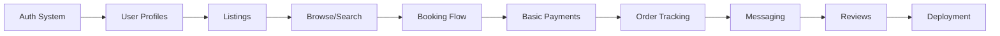

# SkyMarket Phased Development Approach

## Executive Summary
This document outlines a logical technical development approach for SkyMarket MVP, a drone service marketplace serving the greater Detroit metropolitan area. The approach follows a progressive enhancement model, building core functionality first and layering on features in a logical sequence.

## Development Principles
- **MVP First**: Build a functional marketplace quickly to test core assumptions
- **Progressive Enhancement**: Each phase builds on the previous without breaking changes
- **Local Development**: Start with local development before deployment concerns
- **User-Centric**: Focus on solving real problems for Detroit consumers and providers
- **Iterative Approach**: Build, test, and refine each component before moving forward

## Phase 1: Core Platform Foundation

### Authentication & User Management
**Technical Focus:**
- Set up local development environment with Next.js 14 and TypeScript
- Configure Convex backend locally with initial schema
- Implement basic authentication with email/password
- Create user roles (Consumer, Provider, Admin)
- Build user profile management

**Core Features:**
- User registration and login flows
- Role-based access control
- Basic user profiles with essential fields
- Session management

**Technical Stack:**
```typescript
// Initial setup
- Next.js 14 with App Router
- Convex for backend (local development)
- TypeScript for type safety
- Tailwind CSS for styling
```

### Data Models & Listings
**Technical Focus:**
- Design and implement core database schema
- Create CRUD operations for listings
- Build provider dashboard for listing management
- Implement basic search functionality

**Core Features:**
- Provider can create and manage listings
- Four service categories (Food Delivery, Courier, Aerial Imaging, Site Mapping)
- Basic listing details (title, description, price, service area)
- Simple browse and filter functionality

**Data Structure:**
```typescript
// Core models
- users: id, email, role, profile
- listings: id, providerId, title, description, category, price, serviceArea
- categories: food_delivery, courier, aerial_imaging, site_mapping
```

## Phase 2: Marketplace Core Functionality

### Booking System
**Technical Focus:**
- Implement booking flow and state management
- Create booking lifecycle (pending → accepted → in_progress → completed)
- Build consumer booking interface
- Develop provider acceptance workflow

**Core Features:**
- Browse listings and select services
- Configure booking details (location, time, special instructions)
- Request-to-book and instant book options
- Provider notification and acceptance system
- Order management for both consumers and providers

**Technical Implementation:**
```typescript
// Booking states
- bookings: id, consumerId, providerId, listingId, status, location, scheduledAt
- statuses: pending, accepted, in_progress, completed, cancelled
```

### Basic Payment Integration
**Technical Focus:**
- Integrate Stripe for payment processing
- Implement simple payment flow (no escrow initially)
- Build checkout interface
- Create basic payout tracking

**Core Features:**
- Payment collection at booking
- Simple fee structure
- Basic refund capability
- Transaction history

**Note:** Start with basic Stripe Checkout for MVP, add Connect and escrow later

## Phase 3: Real-time Features & Communication

### Location Tracking & Updates
**Technical Focus:**
- Implement real-time location tracking
- Use Convex subscriptions for live updates
- Build tracking UI with map integration
- Create status update system

**Core Features:**
- Live tracking for active deliveries
- Provider location sharing
- ETA calculations
- Status updates (picked up, en route, delivered)
- Basic proof of delivery (photo upload)

**Technical Approach:**
```typescript
// Real-time updates
- Use Convex real-time subscriptions
- Throttle location updates to reduce overhead
- Simple map integration with Mapbox
```

### Messaging System
**Technical Focus:**
- Build in-app messaging between users
- Implement notification system
- Create message history
- Add basic moderation

**Core Features:**
- Consumer-provider chat
- Order-specific message threads
- Basic notifications (in-app only initially)
- Message history and context

## Phase 4: Enhanced Marketplace Features

### Reviews & Ratings
**Technical Focus:**
- Implement two-sided rating system
- Build review collection flow
- Create provider reputation system
- Add review display on listings

**Core Features:**
- Post-delivery ratings
- Written reviews (optional)
- Provider ratings display
- Basic dispute reporting

### Advanced Booking Features
**Technical Focus:**
- Add scheduling capabilities
- Implement recurring bookings
- Build availability management
- Create booking modification flow

**Core Features:**
- Schedule future bookings
- Provider availability calendar
- Booking modifications and cancellations
- Basic capacity management

## Phase 5: Drone-Specific Features

### Basic Compliance Features
**Technical Focus:**
- Add drone operator verification fields
- Implement basic compliance checks
- Create drone-specific listing attributes
- Build media upload for aerial services

**Core Features:**
- Part 107 certificate upload
- Basic service area restrictions
- Drone-specific booking fields
- Media gallery for completed jobs
- Simple compliance checklist

### Location Services Integration
**Technical Focus:**
- Integrate Mapbox for address validation
- Add geocoding for service areas
- Build coverage area visualization
- Implement basic distance calculations

**Core Features:**
- Address autocomplete
- Service area mapping
- Distance-based pricing
- Detroit Metro area boundaries

## Phase 6: Deployment & Polish

### Move to Cloud Deployment
**Technical Focus:**
- Set up Vercel deployment
- Configure environment variables
- Implement basic CI/CD
- Add error monitoring

**Core Features:**
- Deploy to Vercel
- Set up staging environment
- Basic monitoring and logging
- Error tracking setup

### UI/UX Refinement
**Technical Focus:**
- Implement responsive design
- Add loading states and error handling
- Improve form validation
- Enhance mobile experience

**Core Features:**
- Mobile-responsive layouts
- Better error messages
- Loading indicators
- Form improvements
- Basic accessibility features

## Optional Enhancements (Post-MVP)

### Advanced Payment Features
- Stripe Connect for marketplace payments
- Escrow and hold functionality
- Instant payouts for providers
- Advanced fee structures

### AI Integration
- OpenAI for listing optimization
- Smart matching algorithms
- Predictive pricing
- Automated customer support

### Advanced Compliance
- LAANC integration for airspace
- Weather API integration
- FAA database verification
- Automated flight logging

### Business Features
- Provider analytics dashboard
- Admin console for marketplace management
- Promotional codes and discounts
- B2B accounts and invoicing

## Technical Dependencies



### Core Dependencies
- **Authentication** must work before any user-specific features
- **Listings** required before booking can be implemented  
- **Bookings** needed before payments make sense
- **Basic payments** should work before adding tracking
- **Tracking** provides context for messaging
- **Reviews** complete the marketplace loop

### Parallel Development Opportunities
- UI/UX improvements can happen alongside feature development
- Documentation can be created as features are built
- Testing infrastructure can be developed in parallel

## Development Tips for MVP

### Start Simple
- Use basic auth before adding social logins
- Implement simple payment flow before marketplace complexity
- Build desktop-first, add mobile responsiveness later
- Use in-app notifications before push/SMS

### Focus on Core Flow
1. User can sign up and create a profile
2. Provider can list a service
3. Consumer can find and book a service
4. Payment is collected
5. Service is delivered and tracked
6. Both parties can review

### Technical Shortcuts for MVP
- Use Convex's built-in auth instead of external providers
- Start with Stripe Checkout before implementing Connect
- Use basic browser geolocation before advanced mapping
- Implement email notifications with Resend before SMS
- Use simple file upload for media before CDN optimization

### Testing Approach
- Manual testing for MVP is fine
- Focus on happy path scenarios first
- Use test data extensively
- Local development with test Stripe keys
- Deploy to staging first for team testing

## Conclusion

This phased approach provides a logical technical progression for building the SkyMarket MVP. By focusing on core functionality first and progressively enhancing the platform, developers can quickly build a working marketplace while maintaining flexibility for future improvements.

The approach prioritizes getting a functional product that can be tested and validated, rather than building a perfect system from the start. Each phase builds naturally on the previous one, ensuring that development effort is always focused on the most important next step.

---

*This document serves as the technical development guide for the SkyMarket MVP implementation.*