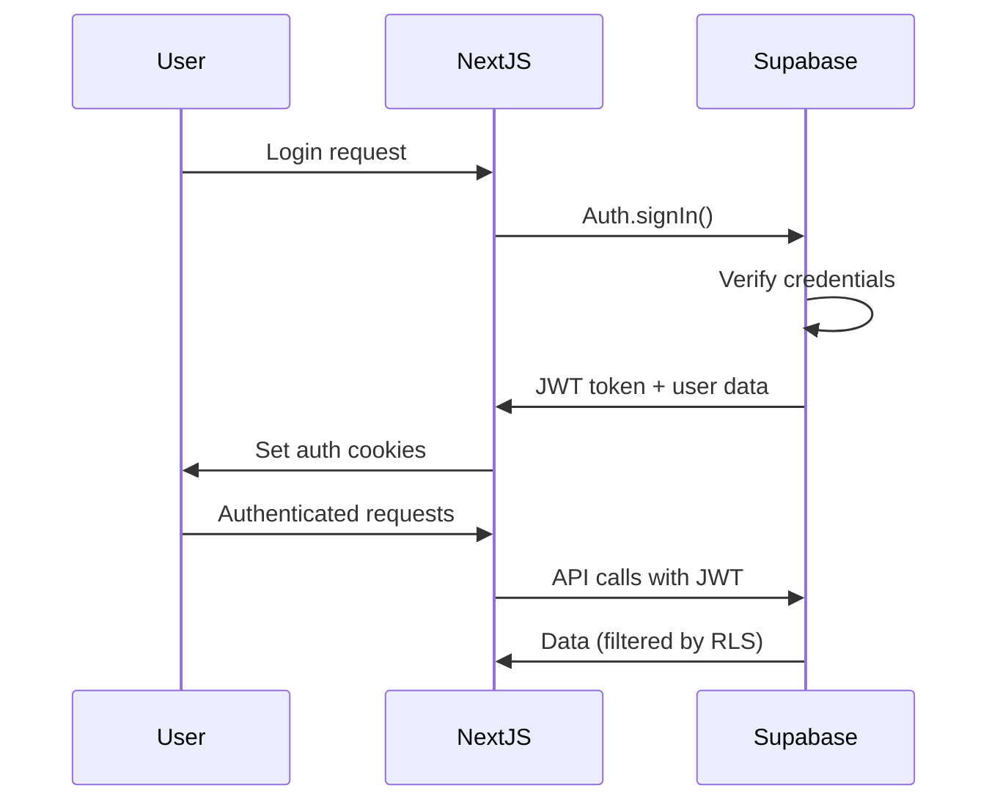

# SkyMarket Technical Architecture

This document describes the technical architecture and design decisions for the SkyMarket drone service marketplace.

## Architecture Overview

SkyMarket follows a modern full-stack architecture using:
- **Frontend**: Next.js 14 with React Server Components
- **Backend**: Supabase (PostgreSQL + Auth + Storage + Realtime)
- **Styling**: Tailwind CSS 3 with shadcn/ui components
- **Type Safety**: TypeScript throughout the stack
- **Payments**: Stripe for secure payment processing
- **Maps**: Mapbox for location services

```
┌─────────────────────────────────────────────────────────────┐
│                    Client (Browser)                         │
├─────────────────────────────────────────────────────────────┤
│                                                             │
│  Next.js 14 Frontend (React 18 + TypeScript)              │
│  ├── App Router (RSC + Client Components)                  │
│  ├── Tailwind CSS 3 + shadcn/ui                           │
│  ├── Supabase Client (Auth + Realtime)                    │
│  └── Third-party SDKs (Stripe, Mapbox)                    │
│                                                             │
├─────────────────────────────────────────────────────────────┤
│                                                             │
│  Next.js API Routes (Server)                              │
│  ├── Authentication middleware                             │
│  ├── Webhook handlers (Stripe)                            │
│  ├── Server actions                                       │
│  └── Edge API routes                                      │
│                                                             │
├─────────────────────────────────────────────────────────────┤
│                                                             │
│  Supabase Backend Services                                │
│  ├── PostgreSQL Database + RLS                            │
│  ├── Authentication & User Management                      │
│  ├── Storage (Images, Documents)                          │
│  ├── Realtime Subscriptions                              │
│  └── Edge Functions (Future)                              │
│                                                             │
├─────────────────────────────────────────────────────────────┤
│                                                             │
│  Third-Party Services                                      │
│  ├── Stripe (Payments + Payouts)                          │
│  ├── Mapbox (Maps + Geocoding)                            │
│  ├── Resend (Transactional Email)                         │
│  └── Vercel (Hosting + Edge Functions)                    │
│                                                             │
└─────────────────────────────────────────────────────────────┘
```

## Frontend Architecture

### Next.js 14 App Router

```typescript
app/
├── (auth)/                    # Route groups
│   ├── login/                 # Auth pages
│   └── signup/
├── browse/                    # Service discovery
│   ├── [category]/            # Dynamic routes
│   └── provider/[id]/         # Provider details
├── dashboard/                 # User dashboards
│   ├── consumer/              # Consumer portal
│   └── provider/              # Provider portal
├── booking/                   # Booking flow
│   ├── [listingId]/           # Booking pages
│   └── confirmation/
├── api/                       # API routes
│   ├── auth/                  # Auth endpoints
│   ├── webhooks/              # Webhook handlers
│   └── payments/              # Payment processing
├── globals.css                # Global styles
├── layout.tsx                 # Root layout
├── page.tsx                   # Homepage
├── loading.tsx                # Global loading UI
├── error.tsx                  # Global error UI
└── not-found.tsx              # 404 page
```

### Component Architecture

```typescript
components/
├── ui/                        # shadcn/ui base components
│   ├── button.tsx             # Button variants
│   ├── card.tsx               # Card layouts
│   ├── form.tsx               # Form components
│   └── ...                    # Other UI primitives
├── layout/                    # Layout components
│   ├── header.tsx             # Site header
│   ├── footer.tsx             # Site footer
│   ├── sidebar.tsx            # Dashboard sidebar
│   └── navigation.tsx         # Navigation menus
├── providers/                 # Provider-specific components
│   ├── listing-card.tsx       # Provider listing display
│   ├── profile-form.tsx       # Provider profile editing
│   ├── dashboard.tsx          # Provider dashboard
│   └── booking-manager.tsx    # Booking management
├── consumers/                 # Consumer-specific components
│   ├── search-bar.tsx         # Service search
│   ├── filter-panel.tsx       # Search filters
│   ├── booking-form.tsx       # Booking creation
│   └── order-tracking.tsx     # Order status tracking
├── shared/                    # Shared components
│   ├── map.tsx                # Mapbox integration
│   ├── rating-stars.tsx       # Rating display
│   ├── payment-form.tsx       # Stripe checkout
│   ├── image-upload.tsx       # File uploads
│   └── loading-states.tsx     # Loading indicators
└── forms/                     # Complex form components
    ├── auth-forms.tsx         # Login/signup forms
    ├── provider-onboarding.tsx # Provider registration
    └── booking-wizard.tsx     # Multi-step booking
```

### State Management

SkyMarket uses a combination of state management approaches:

1. **Server State**: Supabase with React Query patterns
2. **Client State**: React hooks (useState, useReducer)
3. **URL State**: Next.js router for navigation state
4. **Form State**: react-hook-form for complex forms
5. **Real-time State**: Supabase realtime subscriptions

```typescript
// Example: Server state with Supabase
export function useListings(category?: string) {
  return useQuery({
    queryKey: ['listings', category],
    queryFn: async () => {
      const supabase = createClient()
      let query = supabase
        .from('listings')
        .select(`
          *,
          provider:providers (
            *,
            user:profiles (full_name, avatar_url)
          )
        `)
        .eq('active', true)
      
      if (category) {
        query = query.eq('category', category)
      }
      
      const { data, error } = await query
      if (error) throw error
      return data
    }
  })
}
```

## Backend Architecture

### Supabase Database Schema

The database uses PostgreSQL with Row Level Security (RLS) for data protection:

```sql
-- Core entity relationships
profiles (1) ←→ (1) providers
providers (1) ←→ (many) listings
profiles (1) ←→ (many) bookings (consumer)
providers (1) ←→ (many) bookings (provider)
bookings (1) ←→ (1) reviews
bookings (1) ←→ (many) messages
```

### Authentication & Authorization

```typescript
// RLS Policy Examples
-- Providers can only see and edit their own listings
CREATE POLICY "Providers manage own listings" ON listings
  FOR ALL USING (provider_id IN (
    SELECT id FROM providers WHERE user_id = auth.uid()
  ));

-- Users can only see their own bookings
CREATE POLICY "Users see own bookings" ON bookings
  FOR SELECT USING (
    consumer_id = auth.uid() OR 
    provider_id IN (SELECT id FROM providers WHERE user_id = auth.uid())
  );
```

### API Design

#### RESTful Endpoints

```typescript
// API Routes Structure
api/
├── auth/
│   ├── login/route.ts         # POST /api/auth/login
│   ├── signup/route.ts        # POST /api/auth/signup
│   └── callback/route.ts      # GET /api/auth/callback
├── listings/
│   ├── route.ts               # GET /api/listings (search)
│   ├── [id]/route.ts          # GET /api/listings/[id]
│   └── create/route.ts        # POST /api/listings/create
├── bookings/
│   ├── route.ts               # GET /api/bookings
│   ├── create/route.ts        # POST /api/bookings/create
│   └── [id]/
│       ├── route.ts           # GET/PATCH /api/bookings/[id]
│       └── messages/route.ts  # GET/POST messages
├── payments/
│   ├── intent/route.ts        # POST /api/payments/intent
│   ├── confirm/route.ts       # POST /api/payments/confirm
│   └── refund/route.ts        # POST /api/payments/refund
└── webhooks/
    ├── stripe/route.ts        # POST /api/webhooks/stripe
    └── supabase/route.ts      # POST /api/webhooks/supabase
```

#### Real-time Subscriptions

```typescript
// Real-time booking updates
export function useBookingUpdates(bookingId: string) {
  const supabase = createClient()
  const [booking, setBooking] = useState(null)

  useEffect(() => {
    // Subscribe to booking changes
    const subscription = supabase
      .channel(`booking:${bookingId}`)
      .on('postgres_changes', 
        { 
          event: 'UPDATE', 
          schema: 'public', 
          table: 'bookings',
          filter: `id=eq.${bookingId}`
        }, 
        (payload) => setBooking(payload.new)
      )
      .subscribe()

    return () => subscription.unsubscribe()
  }, [bookingId])

  return booking
}
```

## Data Architecture

### Database Design Principles

1. **Normalization**: Minimize data redundancy
2. **Performance**: Strategic denormalization for read-heavy operations
3. **Security**: Row Level Security for all user data
4. **Scalability**: Indexed foreign keys and search fields
5. **Audit**: Created/updated timestamps on all entities

### Core Entities

#### Users & Authentication
```sql
-- Extends Supabase auth.users
CREATE TABLE profiles (
  id UUID PRIMARY KEY REFERENCES auth.users(id),
  email TEXT UNIQUE NOT NULL,
  full_name TEXT,
  role user_role DEFAULT 'consumer',
  -- Additional profile fields
);
```

#### Marketplace Entities
```sql
-- Service providers
CREATE TABLE providers (
  id UUID PRIMARY KEY,
  user_id UUID UNIQUE REFERENCES profiles(id),
  type provider_type NOT NULL, -- 'courier' | 'drone'
  certifications TEXT[],
  verified BOOLEAN DEFAULT FALSE,
  rating DECIMAL(3,2) DEFAULT 0.00,
  -- Performance metrics
);

-- Service listings
CREATE TABLE listings (
  id UUID PRIMARY KEY,
  provider_id UUID REFERENCES providers(id),
  category service_category NOT NULL,
  title TEXT NOT NULL,
  price_base DECIMAL(10,2) NOT NULL,
  service_radius_miles INTEGER DEFAULT 10,
  active BOOLEAN DEFAULT TRUE,
  -- Listing details
);

-- Order management
CREATE TABLE bookings (
  id UUID PRIMARY KEY,
  consumer_id UUID REFERENCES profiles(id),
  provider_id UUID REFERENCES providers(id),
  listing_id UUID REFERENCES listings(id),
  status booking_status DEFAULT 'pending',
  price_total DECIMAL(10,2) NOT NULL,
  -- Location and scheduling
);
```

### Indexing Strategy

```sql
-- Performance indexes
CREATE INDEX idx_listings_category_active ON listings(category, active);
CREATE INDEX idx_bookings_provider_status ON bookings(provider_id, status);
CREATE INDEX idx_bookings_consumer_created ON bookings(consumer_id, created_at DESC);
CREATE INDEX idx_providers_location ON providers USING GIST (location_point);

-- Search indexes
CREATE INDEX idx_listings_search ON listings USING GIN (
  to_tsvector('english', title || ' ' || COALESCE(description, ''))
);
```

## Security Architecture

### Authentication Flow



### Row Level Security (RLS)

All tables implement RLS policies:

```sql
-- Example: Booking privacy
CREATE POLICY "Users see own bookings" ON bookings
  FOR SELECT USING (
    consumer_id = auth.uid() OR 
    provider_id IN (SELECT id FROM providers WHERE user_id = auth.uid())
  );
```

### API Security

1. **Authentication**: JWT validation on protected routes
2. **Authorization**: Role-based access control
3. **Input Validation**: Zod schemas for all inputs
4. **Rate Limiting**: Built-in Next.js rate limiting
5. **CORS**: Configured for production domains

```typescript
// Input validation example
const bookingSchema = z.object({
  listingId: z.string().uuid(),
  scheduledAt: z.date().min(new Date()),
  dropoffAddress: z.string().min(5),
  specialInstructions: z.string().max(500).optional(),
})

export async function POST(request: Request) {
  const body = await request.json()
  const validatedData = bookingSchema.parse(body)
  // Process booking...
}
```

## Performance Architecture

### Frontend Performance

1. **Server Components**: Reduce client-side JavaScript
2. **Static Generation**: Pre-rendered pages where possible
3. **Image Optimization**: Next.js Image component
4. **Code Splitting**: Automatic route-based splitting
5. **Caching**: Aggressive caching strategies

```typescript
// Example: Server Component with caching
export default async function ListingsPage({ 
  params 
}: { 
  params: { category: string } 
}) {
  // This runs on the server and is cached
  const listings = await getListings(params.category)
  
  return (
    <div>
      {listings.map(listing => (
        <ListingCard key={listing.id} {...listing} />
      ))}
    </div>
  )
}

// Cache configuration
export const revalidate = 300 // 5 minutes
```

### Database Performance

1. **Connection Pooling**: Supabase connection pooler
2. **Query Optimization**: Indexed queries and proper JOINs
3. **Read Replicas**: For read-heavy operations
4. **Caching**: Redis-like caching with Supabase

```sql
-- Optimized listing query
SELECT 
  l.*,
  p.rating,
  p.verified,
  pr.full_name as provider_name,
  pr.avatar_url
FROM listings l
JOIN providers p ON l.provider_id = p.id
JOIN profiles pr ON p.user_id = pr.id
WHERE l.category = $1 
  AND l.active = true
  AND ST_DWithin(l.location_point, ST_Point($2, $3), 25000) -- 25km radius
ORDER BY p.rating DESC, l.created_at DESC
LIMIT 20;
```

### Real-time Performance

1. **Selective Subscriptions**: Only subscribe to necessary changes
2. **Debounced Updates**: Prevent excessive re-renders
3. **Connection Management**: Efficient WebSocket usage

```typescript
// Optimized real-time subscription
export function useOrderTracking(orderId: string) {
  return useSubscription(
    `order:${orderId}`,
    (payload) => {
      // Only update if status actually changed
      if (payload.eventType === 'UPDATE' && 
          payload.new.status !== payload.old.status) {
        return payload.new
      }
    },
    { 
      // Debounce rapid updates
      throttle: 1000 
    }
  )
}
```

## Deployment Architecture

### Vercel Deployment

```yaml
# vercel.json
{
  "framework": "nextjs",
  "buildCommand": "npm run build",
  "regions": ["iad1"], # Near Detroit
  "functions": {
    "app/api/webhooks/stripe/route.ts": {
      "maxDuration": 60
    }
  },
  "headers": [
    {
      "source": "/api/(.*)",
      "headers": [
        {
          "key": "Access-Control-Allow-Origin",
          "value": "https://skymarket.com"
        }
      ]
    }
  ]
}
```

### Environment Management

```bash
# Development
.env.local          # Local development
.env.example        # Template for new developers

# Production
Vercel Dashboard    # Production environment variables
Supabase Dashboard  # Database and auth configuration
```

### Monitoring & Observability

1. **Error Tracking**: Vercel Analytics + Sentry
2. **Performance**: Core Web Vitals monitoring
3. **Database**: Supabase dashboard metrics
4. **Payments**: Stripe dashboard monitoring
5. **Custom Metrics**: Business KPIs tracking

## Scalability Considerations

### Database Scaling
- **Vertical Scaling**: Upgrade Supabase plan
- **Read Replicas**: Distribute read queries
- **Connection Pooling**: Efficient connection management
- **Partitioning**: Table partitioning for large datasets

### Application Scaling
- **Edge Functions**: Move compute closer to users
- **CDN**: Static asset distribution
- **Caching**: Redis integration for session data
- **Background Jobs**: Queue processing for async tasks

### Cost Optimization
- **Supabase**: Monitor database size and bandwidth
- **Vercel**: Optimize function execution time
- **Third-party**: Monitor API usage costs
- **Storage**: Implement media compression and cleanup

## Future Architecture Considerations

### Microservices Migration
- **Service Boundaries**: Payment, Notification, Analytics
- **API Gateway**: Centralized routing and auth
- **Message Queues**: Async communication between services
- **Service Mesh**: Advanced networking and observability

### Mobile Architecture
- **React Native**: Shared component library
- **Native Features**: Push notifications, location services
- **Offline Support**: Local data synchronization
- **App Store**: CI/CD for mobile releases

---

This architecture provides a solid foundation for SkyMarket's growth from MVP to enterprise-scale platform while maintaining developer productivity and system reliability.