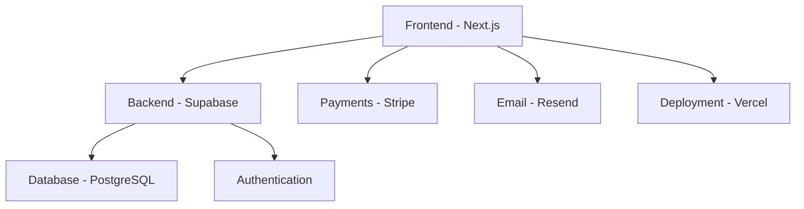

# Step 3: Definition Documents - Understanding Project Specifications

**Objective**: Know what's in the repository and understand why specifications exist. Learn the business domain and technical requirements.

## Overview

Before diving into code, we need to understand the business requirements, technical specifications, and project structure. This step introduces you to the definition documents that guide our implementation.

## Project Documentation Structure

The SkyMarket repository includes comprehensive documentation to guide development:

```
docs/
├── README.md              # Project overview
├── PRD.md                 # Product Requirements Document
├── architecture/          # System design documents
├── definitons/           # Business domain definitions
├── development/          # Development guidelines
└── instructions/         # Implementation guides
```

## Product Requirements Document (PRD)

### What is a PRD?
A Product Requirements Document defines **what** we're building and **why**. It's the bridge between business needs and technical implementation.

### Key Sections You Should Understand

**1. Business Overview**
- SkyMarket serves the Detroit Metro area
- Multi-modal marketplace (drone services, courier, food delivery)
- Commission-based revenue model

**2. User Roles**
- **Consumers**: Book and pay for services
- **Providers**: Offer services and receive payments
- **Admins**: Manage platform and users

**3. Core Features**
- User authentication and profiles
- Service listing creation and management
- Booking system with status tracking
- Payment processing with escrow
- Rating and review system

**4. Business Rules**
- Geographic restriction to Detroit Metro
- Provider verification requirements
- Payment flow and commission structure
- Cancellation and refund policies

## Business Domain Understanding

### Service Categories

**Drone Services**
- Aerial photography/videography
- Site mapping and surveying
- Property inspections
- Emergency response support

**Courier Services**
- Same-day package delivery
- Document transport
- Medical supply delivery
- Grocery and retail delivery

**Food Delivery**
- Restaurant delivery
- Grocery delivery
- Catering services

### User Journey Examples

**Consumer Journey:**
1. Register account → 2. Browse services → 3. Book service → 4. Make payment → 5. Track service → 6. Leave review

**Provider Journey:**
1. Register account → 2. Get verified → 3. Create listings → 4. Receive bookings → 5. Complete service → 6. Get paid

## Technical Architecture Overview

### System Components



### Data Models

**Core Entities:**
- Users (consumers and providers)
- Service Listings
- Bookings
- Payments
- Reviews

**Relationships:**
- Users create Listings
- Users make Bookings
- Bookings have Payments
- Bookings generate Reviews

## Why Specifications Matter

### For Development
- **Clarity**: Know exactly what to build
- **Consistency**: Ensure all features work together
- **Quality**: Meet user expectations
- **Efficiency**: Avoid rebuilding features

### For Business
- **Requirements Traceability**: Ensure all needs are met
- **Scope Management**: Prevent feature creep
- **Quality Assurance**: Test against defined criteria
- **Stakeholder Alignment**: Everyone understands the goals

## Reading the Documentation

### Essential Documents to Review

**Start Here:**
1. `docs/README.md` - Project overview
2. `docs/PRD.md` - Business requirements
3. `docs/architecture/overview.md` - Technical architecture

**Domain Definitions:**
1. `docs/definitons/users.md` - User roles and permissions
2. `docs/definitons/services.md` - Service categories and rules
3. `docs/definitons/booking-flow.md` - Booking process

**Technical Specs:**
1. `docs/development/database-schema.md` - Data structure
2. `docs/development/api-design.md` - API patterns
3. `docs/development/ui-guidelines.md` - Interface standards

### How to Read Technical Specs

**Focus on Understanding:**
- What problems are we solving?
- Who are the users?
- What are the key workflows?
- What are the constraints and requirements?

**Don't Worry About:**
- Implementation details (we'll cover those)
- Complex technical jargon (ask questions)
- Perfect understanding (it comes with practice)

## Key Concepts to Grasp

### Marketplace Mechanics
- **Two-sided market**: Serve both consumers and providers
- **Platform model**: We facilitate transactions, don't provide services
- **Trust and safety**: Verification, ratings, dispute resolution

### Service-Based Business
- **On-demand**: Services delivered when requested
- **Geographic constraints**: Limited to Detroit Metro area
- **Variable pricing**: Providers set their own rates
- **Quality assurance**: Through ratings and reviews

### Technical Patterns
- **Authentication**: Secure user access
- **Authorization**: Role-based permissions
- **Real-time updates**: Live booking status
- **Payment processing**: Secure financial transactions
- **Data consistency**: Accurate information across the system

## Practical Exercise

### Document Review Checklist

Review the following and make notes:

**Business Understanding:**
- [ ] What services does SkyMarket offer?
- [ ] Who are the target users?
- [ ] How does the marketplace make money?
- [ ] What are the key user workflows?

**Technical Understanding:**
- [ ] What technology stack are we using?
- [ ] How is user data organized?
- [ ] What external services do we integrate with?
- [ ] What are the security requirements?

**Domain Knowledge:**
- [ ] What user roles exist?
- [ ] How does the booking process work?
- [ ] What payment flows are required?
- [ ] What data do we collect and store?

### Questions to Ask Yourself

1. **User Perspective**: What would I expect from this marketplace?
2. **Provider Perspective**: How would I want to offer my services?
3. **Business Perspective**: How does this platform create value?
4. **Technical Perspective**: What are the challenging implementation areas?

## Common Patterns in SaaS Applications

Understanding these patterns helps you recognize them in SkyMarket:

### Authentication & Authorization
- User registration and login
- Role-based access control
- Session management
- Password security

### CRUD Operations
- **Create**: Users, listings, bookings
- **Read**: Browse services, view bookings
- **Update**: Edit profiles, update listings
- **Delete**: Cancel bookings, remove listings

### Business Logic
- Validation rules (e.g., service area restrictions)
- State transitions (e.g., booking status changes)
- Calculations (e.g., pricing, commissions)
- Notifications (e.g., booking confirmations)

### Integration Patterns
- Payment processing (Stripe)
- Email notifications (Resend)
- Real-time updates (Supabase)
- File storage (for images, documents)

## Expected Outcome

After completing this step, you should understand:

### Business Domain
- [ ] SkyMarket's purpose and value proposition
- [ ] User roles and their needs
- [ ] Service categories and booking process
- [ ] Business model and constraints

### Technical Architecture
- [ ] High-level system components
- [ ] Technology choices and rationale
- [ ] Data models and relationships
- [ ] Integration requirements

### Development Approach
- [ ] Why we follow specifications
- [ ] How to read technical documentation
- [ ] Key patterns in marketplace applications
- [ ] Questions to ask during development

## Troubleshooting

### Can't Find Documentation
- Check the `docs/` directory in the repository
- Look for README files in subdirectories
- Ask for clarification if documents are missing

### Don't Understand Business Terms
- Refer to the glossary in `docs/definitons/`
- Research marketplace and on-demand service concepts
- Ask questions - understanding the domain is crucial

### Technical Concepts Unclear
- Focus on the big picture first
- Implementation details will come in later steps
- Use the resources links for background reading

## Next Steps

Now that you understand what we're building and why, let's set up the development tools that will help us build it efficiently.

---

**Previous Step**: [Step 2: Environment Setup](./02-environment-setup.md) | **Next Step**: [Step 4: Cursor IDE Install](./04-cursor-install.md)

**Need clarification?** Review the project documentation or check the [Resources](../resources.md) for additional context.